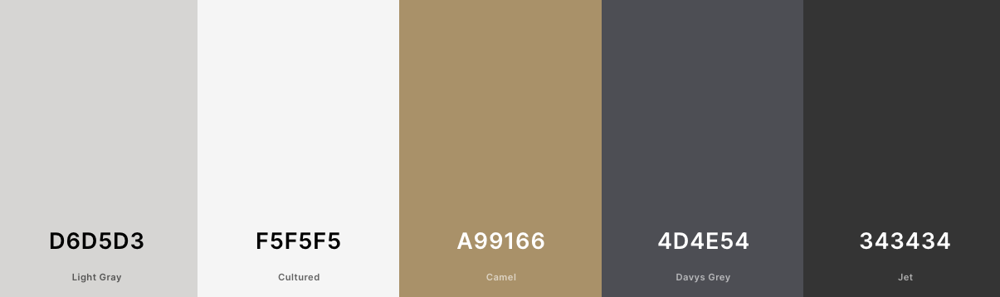
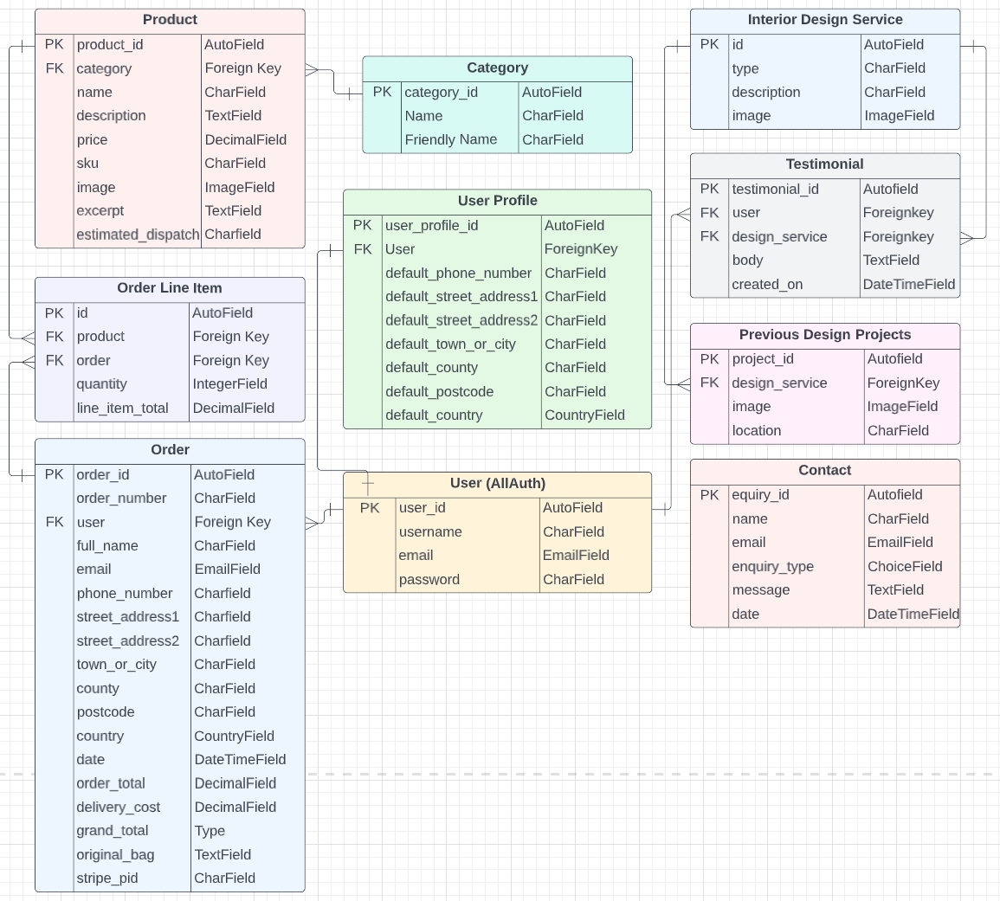
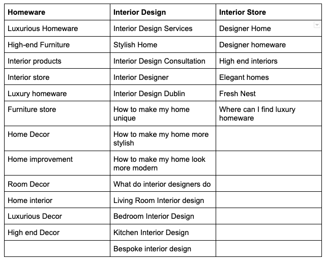
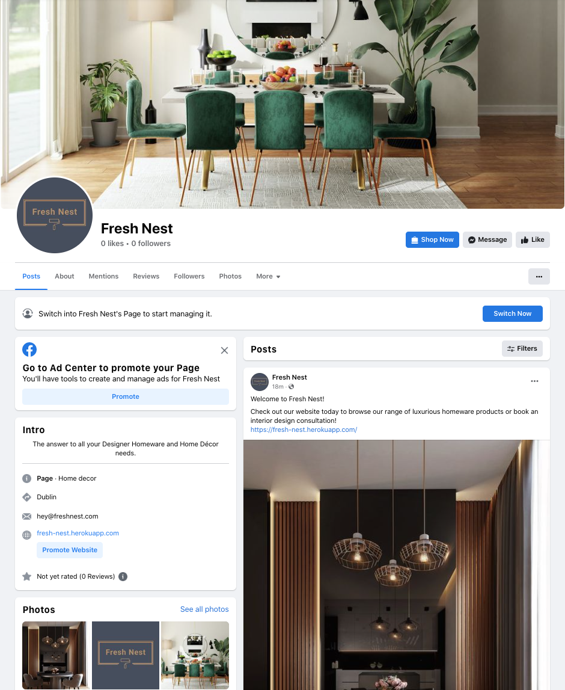

# Fresh Nest

Fresh Nest is a home décor B2C e-commerce store and interior design service provider. The site is targeted towards users who are interested in luxurious interior products and high end interior design services. 

User's can browse and purchase a range of homeware products or check out the different types of interior design services provided and make an enquiry. They can also look at images and testimonials of previously completed design projects or leave a testimonial if they wish.

The payment system uses Stripe. Please note that this website is for educational purposes do not enter any personal credit/debit card details when using the site.

To test this system, test card details can be used. A list of these can be found in Stripe's documentation [here](https://stripe.com/docs/testing#cards).

The live link can be found here - [Fresh Nest](https://fresh-nest.herokuapp.com/)

## User Experience (UX)

A visitor to Fresh Nest would be someone who is most likely an adult who is interested in luxurious interior products and high end interior design services.

### User Stories

#### EPIC | Viewing and Navigation
- As a Site User, I can intuitively navigate around the site so that I can find content.
- As a Site User, I can view a paginated list of products so that I can select a product to view.
- As a shopper, I can click on a product so that I can read the full product details.
- As a shopper I can view a specific category of products so I can browse the type of products I'm looking for.
- As a shopper I can search all products so that I can find what I am looking for.
- As a shopper, I can sort all products so that I can view products based on price or title.
- As a site user, I can view a list of Interior Design Services provided so I can understand what each service entails and make an enquiry if desired.
- As a site user, I can read testimonials left by other customers so I see what feedback they gave on the Interior Design Services they received.
- As a site user, I can view pictures of previous interior design projects so that I can see if I like the results and build trust in the service provider.

#### EPIC | User Account and Profile
- As a site user I can register an account so that I can have a personal account.
- As a site user I can log in or log out of my account so that I can keep my account secure.
- As a site user I can see my login status so that I know if I'm logged in or out.
- As a site user I can save my personal details in my user profile so that I do not have to fill them out for future orders.
- As a site user I can view my order history so that I can remember what purchases I've made.
- As a site user I can recover my password in case I forget it so that I can recover access to my account.

#### EPIC | Purchasing
- As a shopper, I can add a number of products in different quantities to my shopping bag so that I can purchase them all together when I am ready.
- As a shopper I can view a running total of my shopping bag as I am shopping so that I can see how much it costs in total.
- As a shopper I can view a the contents of my shopping bag at any time so I can see what is included and the total cost.
- As a shopper I can adjust the quantity of individual products in my bag so that I can easily make changes before I purchase.
- As a shopper, I can see a summary of my shopping cart when I checkout so that I know what products are included and the total cost before I commit to purchasing.
- As a shopper, I can easily enter my payment information securely so that I can purchase my chosen products quickly with no issues.
- As a shopper checkout as a guest so I don't have to sign up for an account.
- As a shopper, I can view an order confirmation after checkout so that I know my purchase was successful.
- As a shopper, I can receive an email confirmation of my order so that I have a record of my purchase.


#### EPIC | Admin & Store Management
- As a store owner, I can add/edit/delete products through an easy-to-use interface so that I can manage the store's contents.
- As a site owner, I can add/edit/delete interior design services provided through an easy-to-use interface so that I can manage the site's contents.
- As a site owner, I can add/delete images and location of previous design projects so that I can manage the site's contents.
- As a site owner, I can view and delete customer enquiries on the front-end without having to access the admin panel.

#### EPIC | User Interaction
- As a site user, I can submit an enquiry form so that I can enquire about a design consultation.
- As a site user, I can add / edit / delete a testimonial in relation to a consultation I received so that I can give my feedback.

#### User stories not yet implemented

The following user stories were scoped out of the project due to time constraints and labelled as "Won't Have" on the project board on Github. It is intended that these user stories will be implemented at a later date.

- As a shopper I can add products to my saved items so that I can go back and view them at a later date.
- As a shopper I can view my saved products so I can find them easily in the one location.

## Design

The site has a elegant and clean design with the use of gold detail to give the idea of luxury and opulence. 

### Colour Scheme
Colour palette from Coolors



The colour scheme of the site is mainly gold and light and dark greys. The colours chosen are quite neutral in order to showcase the Homeware Products and Interior Design Services with minimal distraction. 

Great care was taken to establish a good contrast between background colours and text at all times to ensure maximum user accessibility.

### Imagery
There is only one main static image on the site which is of a luxurious dining room on the home page. The color scheme of the site ties in with this main homepage image which largely consists of golds and greys. The rest of the imagery will be uploaded by the site owner for individual products, services and previous interior projects. 

### Fonts
The Raleway font is the main font used for the body of the website. This font was imported via Google Fonts. Sans Serif is the backup font, in case for any reason the main font isn't being imported into the site correctly.

## Agile Methodology
Github projects was used to manage the development process using an agile approach. Please see link to project board [here](https://github.com/users/AliOKeeffe/projects/2)


The 5 Epics listed above were documented within the Github project as Milestones. A Github Issue was created for each User Story which was then allocated to a milestone(Epic). Each User Story has defined acceptance criteria to make it clear when the User Story has been completed. The acceptance criteria are further broken down into tasks to facilitate the User Story's execution.


## Database Schema 

Two relational databases were used to create this site - during production SQLite was used and then Postgres was used for the deployed Heroku version. Below is an image of how the database models relate to each other:




## Security Features and Defensive Design
### User Authentication

Where I have used Django's Class-based-views; Django's LoginRequiredMixin is used to make sure that any requests to access secure pages by non-authenticated users are redirected to the login page. Django's UserPassesTestMixin is used to limit access based on certain permissions i.e. to ensure users can only edit/delete Testimonials for which they are the author or if the user is the superuser. If the user doesn't pass the test they are shown an HTTP 403 Forbidden error.

Where I have used function based views I have used Django's login_required and user_passes_test decoraters to restrict access as required. 

### Form Validation
If incorrect or empty data is added to a form, the form won't submit and a warning will appear to the user informing them what field raised the error.

### Database Security
The database url and secret key are stored in the env.py file to prevent unwanted connections to the database. Stripe keys and wh secret are also stored in the env.py file. 

Cross-Site Request Forgery (CSRF) tokens were used on all forms throughout this site.

### Custom error pages:
Custom Error Pages were created to give the user more information on the error and to provide them with buttons to guide them back to the site.

400 Bad Request - Fresh Nest is unable to handle this request.
403 Page Forbidden - Looks like you're trying to access forbidden content. Please log out and sign in to the correct account.
404 Page Not Found - The page you're looking for doesn't exist.
500 Server Error - Fresh Nest is currently unable to handle this request


## Fixed Bugs

### Update bag quantity

I wanted the bag subtotal to automatically update when the product quantity was changed rather than clicking an 'update' link. To do this I wrote an AJAX Post method to request the 'adjust bag' url and populate it with the updated quantity and item id and reload the page. 

When I first attempted to do this I put a click listener on the + and - buttons so the page would automatically update when these were clicked. However I quickly ran into issues due to the fact that there was already a click listener on those buttons (which updates the quantity in the box). After some research I discovered that this issue is called a race condition "an undesirable situation that occurs when a device or system attempts to perform two or more operations at the same time".

In order to solve this problem I removed the click listener which updated the bag total and instead created a new function 'Update Bag' which is called when the +/- is clicked (but after the quantity box is updated). Two parameters are passed into the function (quantity and item ID) and the AJAX method within the function uses these parameters to update the bag total. 

### Deployment

When I initially attempted to deploy to Heroku the build would fail with the error message "Could not build wheels for backports.zoneinfo". This was due to the fact that Heroku by default uses python version 3.10 which isn't compatible with backports.zoneinfo. In order to fix this I had to create a runtime.txt to specify the Python version for Heroku to install (python-3.8.13). However the next time I tried to deploy I got a further error "Requested runtime 'python-3.8.13' is not available for this stack (heroku-22)". After some research I realised that in order to use this version of Python I would have to use heroku-20 instead of heroku-22. I was able to downgrade the heroku version using the command `heroku stack:set heroku-20 -a app name` which resolved the issue and I was able to deploy the site. 

prevent whitespace 
https://stackoverflow.com/questions/19619428/html5-form-validation-pattern-alphanumeric-with-spaces

### Checkout form
When testing the Checkout Form, I was able to input white space into into the form text fields and enter text into the phone number field and still submit the form. This would then return a 500 error however the Stripe payment would still get processed. I had followed the steps in the Boutique Ado project for the checkout app and when I tested the Boutique Ado project and a number of other students projects the same situation would arise when I submitted with form with just whitespace in the form fields. 

I wrote a custom `clean_fieldname` method for a number of the form fields in order to `trim` whitespace from the form fields during form validation. 

``` 
    def clean_full_name(self):
        if not self.cleaned_data['full_name'].strip():
            raise ValidationError("You must enter a fullname")
        return self.cleaned_data['full_name']
```

However this didn't solve the issue as I realised that the form validation wasn't actually getting called before the payment was processed. 

After a bit of digging I discovered that the reason for this is due to the fact the Stripe Javascript is called when the submit button is clicked due to the event listener on the submit button. The Javascript prevents the default form submission meaning that the card is actually charged before any form validation is done. 

When the response comes back from Stripe, the `.then()` part of the JS runs, which checks to see if the card was charged successfully, and if so, the form is then submitted and validation is ran. If the form is valid, it saves the order to the database. If the validation fails webhook will create the order in the database anyway.

As a work around in the short term I was able to add a widget to the form fields in the Checkout Form to specify the pattern attribute of the HTML input. This prevents the form from submitted if there is whitespace at the beginning of a text input or if there is letters in the phone field.

```
        self.fields['full_name'].widget.attrs[
            'pattern'] = "([^\\s][A-z0-9À-ž\x27\\s]+)"
        self.fields['street_address1'].widget.attrs[
            'pattern'] = "([^\\s][A-z0-9À-ž\x27\\s]+)"
        self.fields['town_or_city'].widget.attrs[
            'pattern'] = "([^\\s][A-z0-9À-ž\x27\\s]+)"
```

I found [this](https://stackoverflow.com/questions/19619428/html5-form-validation-pattern-alphanumeric-with-spaces) stackoverflow post helpful when learning about the pattern attribute.

Ideally I would have preferred to find a way to perform full form validation before the payment is processed however due to time contraints I was unable to figure out a work around for the purpose of this project. A suggestion would be to create the order in the database `on submit` with a status of "Pending" and then process the Payment. Once the payment is processed successfully, update the order status to "complete" in the database. 


## Marketing Strategy

A number of different marketing strategies have been utilised to promote Fresh Nest including SEO, content marketing, social media marketing and email marketing. Each of these strategies have been discussed individually below:  

### SEO
Several SEO techniques were undertaken in order to ensure the site ranks highly in search engine results:

**Keywords:** 

A mixture of short tail and long tail keywords were carefully considered for the site. Keyword research was performed by checking Google search results, looking at competitor's keywords and by utilising wordtracker.com. 

An initial list of topics and keywords generated can be seen below. This list was then refined based on relevance and authority.

The most relevant keywords have been added to the site's meta-keywords and meta-description. These keywords have also been carefully included in page titles, headings, site content, `<strong></strong>` tags, image alt attributes and anchor tag links across the site. 

 

**External Links:**

Included in the site footer are links to other high quality relevant websites including Houzz, Institute of Designers Ireland, and The Interiors Association. Thes links show search engines that the page is of good quality improving the site's ranking futher. 

**Building Trust:**

In order to build brand trust, a testimonal page for interior design services has been included in the site with a link to the page being included in the page footer as well as the main nav bar. 

The page footer also includes links to the privacy policy to inform users about how their data is being collected and processed.

**Sitemap and robots.txt**

A sitemap file with a list of important page URLs was created to ensure that search engines are able to understand the site's structure and easily navigate through the site. This was made using xml-sitemaps.com.

A robots.txt file was created to tell search engines where the are not allowed to go on the website. This improves SEO by increasing the quality of the site

### Content marketing 
The site showcases high quality images of previous interior design projects projects in order to attract potential new clients. The photos allow the business to show off their expertise and style and build up trust with the customer.

### Social Media Marketing 
For this site, a Facebook business page has been created for organic social media marketing. The Facebook page includes a 'Shop Now' button which takes the user to the Fresh Nest website. The page pairs well with the content media marketing on the main site as images of previous projects and new product arrivals can be shared easily.



### Email Marketing
Visitors to the site can sign up to the newsletter and do not need to have an account to do so. A signup box is included in the footer of the site. This allows the business to share news with customers and potential customers including new products/services and special offers. Mailchimp was used to create this service. 
