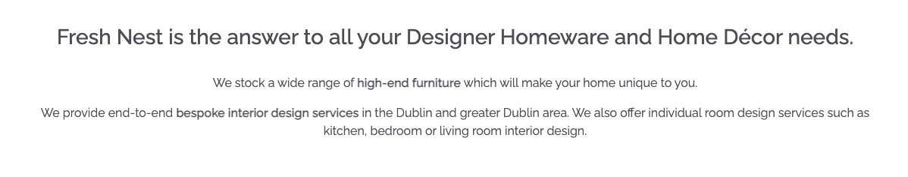

# Fresh Nest

Fresh Nest is a home décor B2C e-commerce store and interior design service provider. The site is targeted towards users who are interested in luxurious interior products and high end interior design services. 

User's can browse and purchase a range of homeware products or check out the different types of interior design services provided and make an enquiry. They can also look at images and testimonials of previously completed design projects or leave a testimonial if they wish.

The payment system uses Stripe. Please note that this website is for educational purposes do not enter any personal credit/debit card details when using the site.

To test this system, test card details can be used. A list of these can be found in Stripe's documentation [here](https://stripe.com/docs/testing#cards).

The live link can be found here - [Fresh Nest](https://fresh-nest.herokuapp.com/)

## User Experience (UX)

A visitor to Fresh Nest would be someone who is most likely an adult who is interested in luxurious interior products and high end interior design services.

### User Stories

#### EPIC | Viewing and Navigation
- As a Site User, I can intuitively navigate around the site so that I can find content.
- As a Site User, I can view a list of products so that I can select a product to view.
- As a shopper, I can click on a product so that I can read the full product details.
- As a shopper I can view a specific category of products so I can browse the type of products I'm looking for.
- As a shopper I can search all products so that I can find what I am looking for.
- As a shopper, I can sort all products so that I can view products based on price or title.
- As a site user, I can view a list of Interior Design Services provided so I can understand what each service entails and make an enquiry if desired.
- As a site user, I can read testimonials left by other customers so I see what feedback they gave on the Interior Design Services they received.
- As a site user, I can view pictures of previous interior design projects so that I can see if I like the results and build trust in the service provider.

#### EPIC | User Account and Profile
- As a site user I can register an account so that I can have a personal account.
- As a site user I can log in or log out of my account so that I can keep my account secure.
- As a site user I can see my login status so that I know if I'm logged in or out.
- As a site user I can save my personal details in my user profile so that I do not have to fill them out for future orders.
- As a site user I can view my order history so that I can remember what purchases I've made.
- As a site user I can recover my password in case I forget it so that I can recover access to my account.

#### EPIC | Purchasing
- As a shopper, I can add a number of products in different quantities to my shopping bag so that I can purchase them all together when I am ready.
- As a shopper I can view a running total of my shopping bag as I am shopping so that I can see how much it costs in total.
- As a shopper I can view a the contents of my shopping bag at any time so I can see what is included and the total cost.
- As a shopper I can adjust the quantity of individual products in my bag so that I can easily make changes before I purchase.
- As a shopper, I can see a summary of my shopping cart when I checkout so that I know what products are included and the total cost before I commit to purchasing.
- As a shopper, I can easily enter my payment information securely so that I can purchase my chosen products quickly with no issues.
- As a shopper checkout as a guest so I don't have to sign up for an account.
- As a shopper, I can view an order confirmation after checkout so that I know my purchase was successful.
- As a shopper, I can receive an email confirmation of my order so that I have a record of my purchase.


#### EPIC | Admin & Store Management
- As a store owner, I can add/edit/delete products through an easy-to-use interface so that I can manage the store's contents.
- As a site owner, I can add/edit/delete interior design services provided through an easy-to-use interface so that I can manage the site's contents.
- As a site owner, I can add/delete images and location of previous design projects so that I can manage the site's contents.
- As a site owner, I can view and delete customer enquiries on the front-end without having to access the admin panel.

#### EPIC | User Interaction
- As a site user, I can submit an enquiry form so that I can enquire about a design consultation.
- As a site user, I can add / edit / delete a testimonial in relation to a consultation I received so that I can give my feedback.
- As a site user, I can sign up for the website's newsletter so that I can keep up to date with new products and promotions.

#### User stories not yet implemented

The following user stories were scoped out of the project due to time constraints and labelled as "Won't Have" on the project board on Github. It is intended that these user stories will be implemented at a later date.

- As a shopper I can add products to my saved items so that I can go back and view them at a later date.
- As a shopper I can view my saved products so I can find them easily in the one location.

## Design

The site has a elegant and clean design with the use of gold detail to give the idea of luxury and opulence. 

### Colour Scheme
Colour palette from Coolors


The colour scheme of the site is mainly gold and light and dark greys. The colours chosen are quite neutral in order to showcase the Homeware Products and Interior Design Services with minimal distraction. 

Great care was taken to establish a good contrast between background colours and text at all times to ensure maximum user accessibility.

### Imagery
There is only one main static image on the site which is of a luxurious dining room on the home page. The color scheme of the site ties in with this main homepage image which largely consists of golds and greys. The rest of the imagery will be uploaded by the site owner for individual products, services and previous interior projects. 

### Fonts
The Raleway font is the main font used for the body of the website. This font was imported via Google Fonts. Sans Serif is the backup font, in case for any reason the main font isn't being imported into the site correctly.

## Agile Methodology
Github projects was used to manage the development process using an agile approach. Please see link to project board [here](https://github.com/users/AliOKeeffe/projects/2)


The 5 Epics listed above were documented within the Github project as Milestones. A Github Issue was created for each User Story which was then allocated to a milestone(Epic). Each User Story has defined acceptance criteria to make it clear when the User Story has been completed. The acceptance criteria are further broken down into tasks to facilitate the User Story's execution.


## Database Schema 

Two relational databases were used to create this site - during production SQLite was used and then Postgres was used for the deployed Heroku version. Below is an image of how the database models relate to each other:


## Security Features and Defensive Design
### User Authentication

Where I have used Django's Class-based-views; Django's LoginRequiredMixin is used to make sure that any requests to access secure pages by non-authenticated users are redirected to the login page. Django's UserPassesTestMixin is used to limit access based on certain permissions i.e. to ensure users can only edit/delete Testimonials for which they are the author or if the user is the superuser. If the user doesn't pass the test they are shown an HTTP 403 Forbidden error.

Where I have used function based views I have used Django's login_required and user_passes_test decoraters to restrict access as required. 

### Form Validation
If incorrect or empty data is added to a form, the form won't submit and a warning will appear to the user informing them what field raised the error.

### Database Security
The database url and secret key are stored in the env.py file to prevent unwanted connections to the database. Stripe keys and wh secret are also stored in the env.py file. 

Cross-Site Request Forgery (CSRF) tokens were used on all forms throughout this site.

### Custom error pages:
Custom Error Pages were created to give the user more information on the error and to provide them with buttons to guide them back to the site.

400 Bad Request - Fresh Nest is unable to handle this request.
403 Page Forbidden - Looks like you're trying to access forbidden content. Please log out and sign in to the correct account.
404 Page Not Found - The page you're looking for doesn't exist.
500 Server Error - Due to an internal error we are unable to process this request.

## Features

### Header

**Logo**
- A customised logo was created using Hatchful by Shopify which is a free logo generator.
- This logo is positioned in the top left of the navigation bar. The logo is linked to the home page for ease of navigation for the user.

**Navigation Bar**

- The navigation bar is present at the top of every page and includes all links to the various other pages.


**User Icon**
- The User icon navigation link is a drop down menu which includes the Sign up and Log in links. 
- The options to Sign up or Log in will change to the option to log out once a user has logged in.
- Once a user has signed in, the 'My Profile' option becomes available in the User dropdown.
- If the superuser has signed in, more options such as 'Home Decor Management', 'Design Service Management', 'Previous Project Management' and 'Enquiries' become available in the User dropdown.
- The navigation bar is fully responsive, collapsing into a hamburger menu when the screen size becomes too small.
- Hovering over the links will turn the font gold.

**Bag Icon**
- Located on the right side of the navbar next to the Uuer icon is the bag Icon.
- Once a product is added to the bag, a number displaying the total quantity of items appears, located at the top right of the bag icon.
- Clicking the bag icon navigates the user to the shopping bag page which displays a summary of what's been added.

**Search Bar**
- Located above the navbar is a search bar. On smaller screens, this bar becomes a search icon which when clicked will drop down the full bar.
- Any searched word will match itself to any text in the product's title, or description and display the results on the product's page.

### Footer


- The footer appears at the bottom of every page.
- The footer section includes links to Facebook, Instagram, Twitter and Pinterest
- There is a newletter signup section powered by Mailchimp where the user can input their email address to signup to the monthly newsletter.
- The Quick Links section has links to the main parts of the site including 'Contact Us' and 'Privacy Policy'.
- On the right hand side of the footer there are links high quality relevant websites including Houzz, Institute of Designers Ireland, and The Interiors Association. These links were included to increase the search rating of the website.
- Clicking all external links will open up the respective website in another tab to avoid pulling the user away from the site.

### Home Page

**Call to Action Section**


- The home page includes a call to action section which encourages the user to 'shop now' or to browse "design services" with the message "Style Your Space" and an image of stylish dining room. 

**What We Do Section**



- The "What We Do' section gives a brief overview of what the site has to offer and includes relevant keywords in `<strong></strong>` tags to improve the site's search ranking.

### User Account Pages

**Sign Up**


**Log In**


**Log Out**


- Django allauth was installed and used to create the Sign up, Log in and Log out functionality. 
- Success messages inform the user if they have logged in/ logged out successfully.
- When a user signs up for an account they must verify their email address by clicking on the authentication link emailed  to the address they provided.
- If a user forgets thier password they can reset it by clicking the 'Forgot Password' on the long in page.


### Profile
**Delivery Details**
- The delivery details section stores the user's delivery address and phone number.
- The information provided here is used to autofill the delivery address when placing an order.

**Order History**
- The order history section a list of every order the user has placed.
- The table displays the order number, date it was ordered and the order total.
- Clicking the order number will take the user to a summary page of that order.

### Home Decor (Products)

- When clicking the 'Home Decor' link in the navbar the dropdown menu will show all the different categories including 'Sofas', 'Tables', 'Chairs', 'Lighting' and 'Textiles'. 
- The 'All' link will display a list of all products from the database.
- Clicking any of the categories will filter the products to only show products from the category selected. 
- The category selected will display as the page heading.
- Each product card shows an image of the product, its title, excerpt and price.
- If the user is a superuser, edit and delte buttons will appear at the bottom of the product card.
- The products page is fully responsive, adjusting how many products are on each row depending on the user's screen size.

- A sort box is located on the products page where users can sort all products by price in ascending or descending order and by title (A-Z).

### Product Detail
- When the user clicks on an individual product card they are taken to the full product details. The link is a bootstrap stretched link so clicking anywhere on the card will work.
- The product detail page displays the product image, title, excerpt, price, product details and estimated dispatch time.
- If the user is a superuser, edit and delte buttons will appear below these details.

**Quantity Buttons**
- The quantity buttons are located underneath the product details and are used to add items to the bag.
- The plus and minus buttons increase and decrease the input value.
- If the value is set to 1 the minus quantity will be disabled. Respectively if the value is set to 99 the plus button is disabled.
- If the user manually types in a negative number or a number >99 and clicks "Add to Bag" an error button will appear informing the user of the parameters needed to be successful.
- Clicking the 'Add to Bag' button takes the number in the input field and adds that amount of products to the bag.
- Clickin the 'Keep Shopping' button takes the user back to the store.

### Home Decor Management
**Add Product**
- The add product page can be accessed by clicking the 'Add Product' button on the Home Decor page or in the user dropdown menu, under Home Decor Management. These options are only visible to superusers.
- If a user tries to add a product (by changing the url) without being a superuser they are redirected to a customer 403 page.
- The user must fill out all the fields that have an Asterix. If the form is submitted with any of these fields left blank or with just whitespace then an error message will appear above that particular field, notifying the user of the issue.
- The SKU field must be unique. An error message will appear if the SKU already exists.
- If a price is added with more than 6 digits the form will fail and an error message will appear under the price field.
- The user can upload a photo if they wish. If they choose not to, a default image displays as their product image.
- Clicking the 'Add Product' button at the bottom of the form will create the product providing there are no errors on the form.
-  The user will receive a success message notifying them that the product has been successfully added.

**Edit Product**
- The superuser can choose to edit a Product by clicking the edit button on the product card or on the product detail page. 
- The form opens with all fields populated with the original content.
- The image field displays a thumbnail of the current image and has a checkbox option to remove it. Checking this will change the image to the default image.
- If a user tries to add a product (by changing the url) without being a superuser they are redirected to a customer 403 page.
- The superuser will receive a success message notifying them that the product has been successfully updated.

**Delete Product**
- The superuser can choose to delete a Product by clicking the delete button on the product card or on the product detail page. 
- The superuser is asked to confirm if they wish to delete the product or cancel.
- The superuser will receive a success message notifying them that the product has been successfully deleted.

### Bag
- When the user clicks on the shopping bag icon in the nav bar they are taken to the shopping bag page which shows the products which the user has added to their cart, unit price, quantity and subtotal.

**Quantity Buttons**
- The quantity input box displays the product quantity the user has added to their bag.
- The plus and minus buttons increase and decrease the input value.
- If the value is set to 1 the minus quantity will be disabled. Respectively if the value is set to 99 the plus button is disabled.

**Update and Delete Buttons**
- Clicking the 'update' icon button saves any changes to the quantity and updates the item's subtotal.
- Clicking the 'Bin' icon button removes the item completely from the user's bag.
- If the user manually types in a negative number and clicks 'update', the item will be removed from the item from the bag.
- If the user manually types in a number >99 and clicks 'update' an error message will display informing the user of the correct parameters.

**Total Section**
- At the end of the line items is a summary of the costs.
- The summary features the bags total, delivery cost and the grand total to pay.
- Underneath the grand total users will find a message informing them of how much more they need to spend to receive free delivery if they haven't already met the free delivery threshold (€250). 
- Beneath the grand total is two buttons. From here the user can either continue to the checkout or return to the products page by clicking 'Continue Shopping'.

### Checkout 

**Details**
- Within the details dection the user can fill out their contact details, delivery address, and card number.
- If the user is a guest, a link to create an account or login will be present.
- If the user is signed in a checkbox to save the delivery information can be checked.
- If the user is signed in and has delivery information saved, the delivery details and email address will be automatically filled in.
- If a user leaves a required field empty, inputs whitespace in a required field or includes text in the phone number field an error message will prompt the user to 'Fill in the field' or 'match the format requested'

**Order Summary**
- The order summary section details all the items about to be purchased, along with the quantity, subtotal and a grand total.
- Next to the order summary title will be a number reflecting the total number of items that appear in the order.
- Clicking the product image in the summary will take the user to that product's detail page.

**Payment**
- The card payment is handled by Stripe to ensure secure payment.
- Incorrect card numbers will automatically show an invalid card number error.
- A loading screen will appear when a payment is being processed to stop the user clicking away.
- There is a warning message at the bottom of the page informing the user of how much their card is about to be charged.
- If the payment form doesn't submit properly or the user closes the browser during the wait animation, the order will still be created in the database through the webhook. 
- Once the payment is processed, the webhook will search the database to confirm the order exists. If it cannot find it, it will create one using the payment information.

**Confirmation**
- Once the order has been processed the user is taken to the checkout success page.
This page summarises the completed order.
- An email wil be sent to the user with their order confirmation
- At the end of the summary is a 'Keep Shopping' button that takes the user back to the Home Decor page.


## Fixed Bugs

### Update bag quantity

I wanted the bag subtotal to automatically update when the product quantity was changed rather than clicking an 'update' link. To do this I wrote an AJAX Post method to request the 'adjust bag' url and populate it with the updated quantity and item id and reload the page. 

When I first attempted to do this I put a click listener on the + and - buttons so the page would automatically update when these were clicked. However I quickly ran into issues due to the fact that there was already a click listener on those buttons (which updates the quantity in the box). After some research I discovered that this issue is called a race condition "an undesirable situation that occurs when a device or system attempts to perform two or more operations at the same time".

In order to solve this problem I removed the click listener which updated the bag total and instead created a new function 'Update Bag' which is called when the +/- is clicked (but after the quantity box is updated). Two parameters are passed into the function (quantity and item ID) and the AJAX method within the function uses these parameters to update the bag total. 

### Deployment

When I initially attempted to deploy to Heroku the build would fail with the error message "Could not build wheels for backports.zoneinfo". This was due to the fact that Heroku by default uses python version 3.10 which isn't compatible with backports.zoneinfo. In order to fix this I had to create a runtime.txt to specify the Python version for Heroku to install (python-3.8.13). However the next time I tried to deploy I got a further error "Requested runtime 'python-3.8.13' is not available for this stack (heroku-22)". After some research I realised that in order to use this version of Python I would have to use heroku-20 instead of heroku-22. I was able to downgrade the heroku version using the command `heroku stack:set heroku-20 -a app name` which resolved the issue and I was able to deploy the site. 

prevent whitespace 
https://stackoverflow.com/questions/19619428/html5-form-validation-pattern-alphanumeric-with-spaces

### Checkout form
When testing the Checkout Form, I was able to input white space into into the form text fields and enter text into the phone number field and still submit the form. This would then return a 500 error however the Stripe payment would still get processed. I had followed the steps in the Boutique Ado project for the checkout app and when I tested the Boutique Ado project and a number of other students projects the same situation would arise when I submitted with form with just whitespace in the form fields. 

I wrote a custom `clean_fieldname` method for a number of the form fields in order to `trim` whitespace from the form fields during form validation. 

``` 
    def clean_full_name(self):
        if not self.cleaned_data['full_name'].strip():
            raise ValidationError("You must enter a fullname")
        return self.cleaned_data['full_name']
```

However this didn't solve the issue as I realised that the form validation wasn't actually getting called before the payment was processed. 

After a bit of digging I discovered that the reason for this is due to the fact the Stripe Javascript is called when the submit button is clicked due to the event listener on the submit button. The Javascript prevents the default form submission meaning that the card is actually charged before any form validation is done. 

When the response comes back from Stripe, the `.then()` part of the JS runs, which checks to see if the card was charged successfully, and if so, the form is then submitted and validation is ran. If the form is valid, it saves the order to the database. If the validation fails webhook will create the order in the database anyway.

As a work around in the short term I was able to add a widget to the form fields in the Checkout Form to specify the pattern attribute of the HTML input. This prevents the form from submitted if there is whitespace at the beginning of a text input or if there is letters in the phone field.

```
        self.fields['full_name'].widget.attrs[
            'pattern'] = "([^\\s][A-z0-9À-ž\x27\\s]+)"
        self.fields['street_address1'].widget.attrs[
            'pattern'] = "([^\\s][A-z0-9À-ž\x27\\s]+)"
        self.fields['town_or_city'].widget.attrs[
            'pattern'] = "([^\\s][A-z0-9À-ž\x27\\s]+)"
```

I found [this](https://stackoverflow.com/questions/19619428/html5-form-validation-pattern-alphanumeric-with-spaces) stackoverflow post helpful when learning about the pattern attribute.

Ideally I would have preferred to find a way to perform full form validation before the payment is processed however due to time contraints I was unable to figure out a work around for the purpose of this project. A suggestion would be to create the order in the database `on submit` with a status of "Pending" and then process the Payment. Once the payment is processed successfully, update the order status to "complete" in the database. 


## Marketing Strategy

A number of different marketing strategies have been utilised to promote Fresh Nest including SEO, content marketing, social media marketing and email marketing. Each of these strategies have been discussed individually below:  

### SEO
Several SEO techniques were undertaken in order to ensure the site ranks highly in search engine results:

**Keywords:** 

A mixture of short tail and long tail keywords were carefully considered for the site. Keyword research was performed by checking Google search results, looking at competitor's keywords and by utilising wordtracker.com. 

An initial list of topics and keywords generated can be seen below. This list was then refined based on relevance and authority.

The most relevant keywords have been added to the site's meta-keywords and meta-description. These keywords have also been carefully included in page titles, headings, site content, `<strong></strong>` tags, image alt attributes and anchor tag links across the site. 

 

**External Links:**

Included in the site footer are links to other high quality relevant websites including Houzz, Institute of Designers Ireland, and The Interiors Association. Thes links show search engines that the page is of good quality improving the site's ranking futher. 

**Building Trust:**

In order to build brand trust, a testimonal page for interior design services has been included in the site with a link to the page being included in the page footer as well as the main nav bar. 

The page footer also includes links to the privacy policy to inform users about how their data is being collected and processed.

**Sitemap and robots.txt**

A sitemap file with a list of important page URLs was created to ensure that search engines are able to understand the site's structure and easily navigate through the site. This was made using xml-sitemaps.com.

A robots.txt file was created to tell search engines where the are not allowed to go on the website. This improves SEO by increasing the quality of the site

### Content marketing 
The site showcases high quality images of previous interior design projects projects in order to attract potential new clients. The photos allow the business to show off their expertise and style and build up trust with the customer.

### Social Media Marketing 
For this site, a Facebook business page has been created for organic social media marketing. The Facebook page includes a 'Shop Now' button which takes the user to the Fresh Nest website. The page pairs well with the content media marketing on the main site as images of previous projects and new product arrivals can be shared easily.


### Email Marketing
Visitors to the site can sign up to the newsletter and do not need to have an account to do so. A signup box is included in the footer of the site. This allows the business to share news with customers and potential customers including new products/services and special offers. Mailchimp was used to create this service. 
