# Testing

- [User Story Testing](#user-story-testing)
- [Validator Testing](#validator-testing)
  * [HTML](#html)
  * [CSS](#css)
  * [JSHINT](#jshint)
  * [Python Validation - Pycodestyle](#python-validation---pycodestyle)
  * [Lighthouse](#lighthouse)
- [Device Testing](#device-testing)
- [Browser Testing](#browser-testing)
- [Manual Testing](#manual-testing)
  * [Site Navigation](#site-navigation)
  * [Home Page](#home-page)
  * [All Auth Pages](#all-auth-pages)
  * [Home Decor](#home-decor)
  * [Product Detail](#product-detail)
  * [Home Decor Management](#home-decor-management)
  * [Bag](#bag)
  * [Checkout](#checkout)
  * [Profile](#profile)
  * [Interior Design Services](#interior-design-services)
  * [Interior Design Management](#interior-design-management)
  * [Testimonials](#testimonials)
  * [Testimonial Management](#testimonial-management)
  * [Contact](#contact)
  * [Enquiries Dashboard](#enquiries-dashboard)
- [Fixed Bugs](#fixed-bugs)

<small><i><a href='http://ecotrust-canada.github.io/markdown-toc/'>Table of contents generated with markdown-toc</a></i></small>


## User Story Testing

### EPIC | Viewing and Navigation
*As a Site User, I can intuitively navigate around the site so that I can find content.*

- A navigation bar is visible on every page of the site which is fully responsive on different screen sizes.

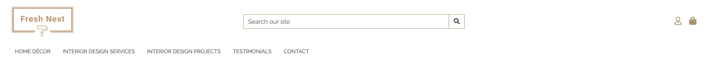

*As a Site User, I can view a list of products so that I can select a product to view.*

- When the user navigates to the all products page they are presented with a list of all products from the database.

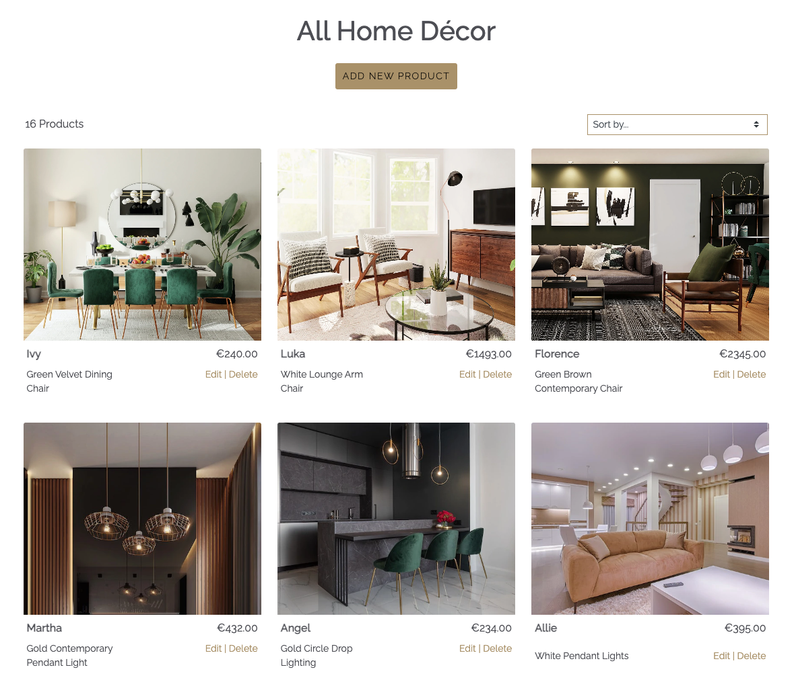

*As a shopper, I can click on a product so that I can read the full product details.*
- When the user clicks on an individual product they are taken to the full product details.

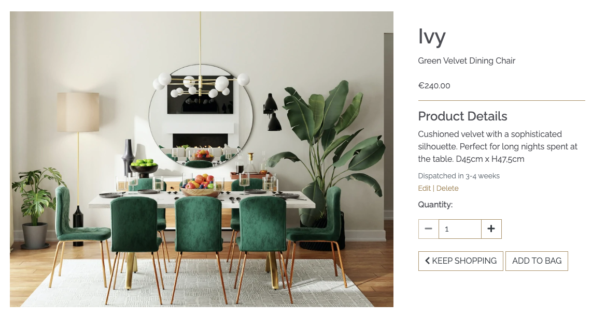

*As a shopper I can view a specific category of products so I can browse the type of products I'm looking for.*
- When clicking the 'Home Decor' link in the navbar the dropdown menu will show all the different categories. Clicking any of these will take the user to the products page, showing only items from the category selected. The category selected will display as the page heading.

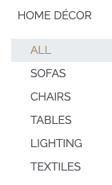


 
*As a shopper I can search all products so that I can find what I am looking for*
- Located above the navbar is a search bar. On smaller screens, this bar becomes a search icon which when clicked will drop down the full bar. Any searched word will match itself to any text in the product's title, or description and display the results on the product's page.

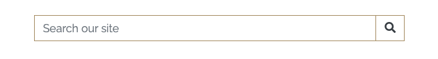

*As a shopper, I can sort all products so that I can view products based on price or title.*
- A sort box is located on the products page where users can sort all products by price in ascending or descending order and by title (A-Z). 

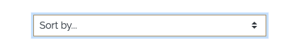

*As a site user, I can view a list of Interior Design Services provided so I can understand what each service entails and make an enquiry if desired.*
- When the user navigates to the Interior Design Services page they are presented with a list of all Interior Design Services from the database along with detailed descriptions. An "Enquire Now" button displays beside each service which will take the user to the Contact form when clicked.

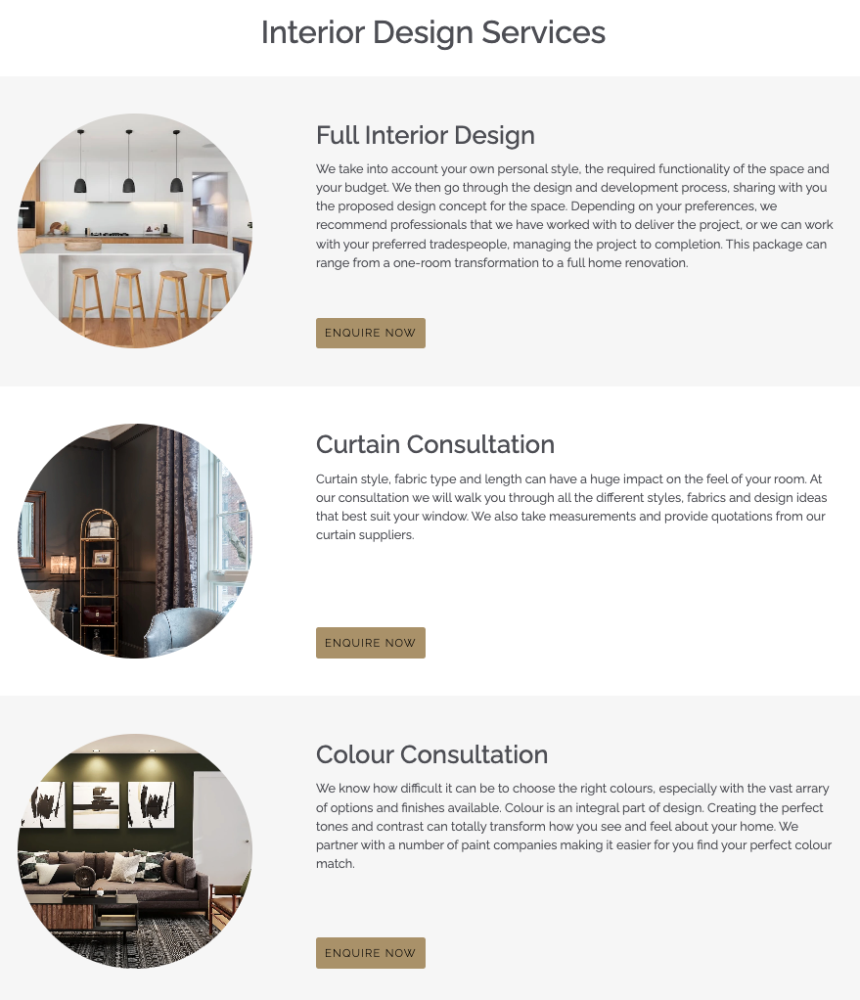

*As a site user, I can read testimonials left by other customers so I see what feedback they gave on the Interior Design Services they received.*
- When the user navigates to the Testimonials page they can see testimonials left by previous clients. Each testimonial displays the Design Service they relate to, the date and the user's name.


*As a site user, I can view pictures of previous interior design projects so that I can see if I like the results and build trust in the service provider.*
- When the user clicks on the Interior Design Projects tab in the nav bar they are taken to a page displaying pictures of previous projects completed by Fresh Nest.
- When the user hovers over the image on Desktop view, the type of design service and location will appear in the centre of the image.
- When the user views the page on mobile, the type of design service and location will display below the image.

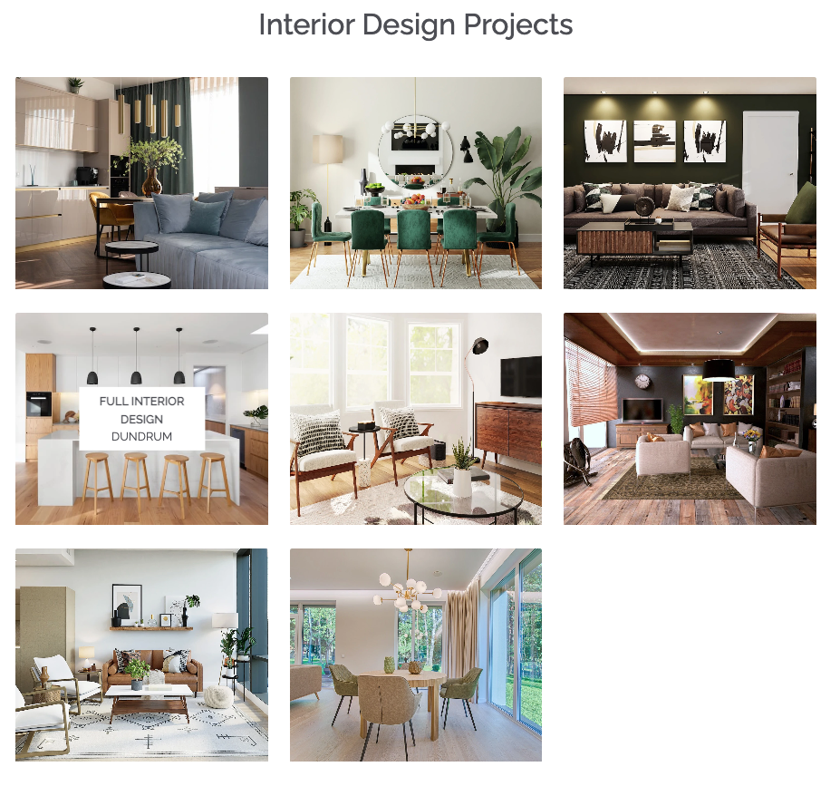


### EPIC | User Account and Profile
*As a site user I can register an account so that I can have a personal account.*
- A sign up button is located in the user options drop down menu in the Navbar. When the user clicks the button they are taken to the sign up page.

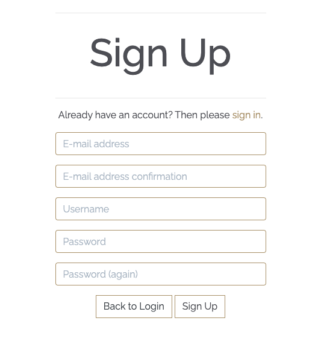

*As a site user I can log in or log out of my account so that I can keep my account secure.*
- If the user has registered an account they can log in or log out by clicking the links in the user options drop down menu in the Navbar.


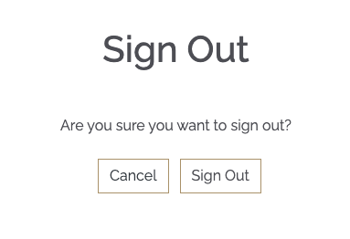

*As a site user I can see my login status so that I know if I'm logged in or out.*

- Whenever a user logs in or logs out a toast message will appear notifying the user or their action.
- Their user name will display in the navbar.
- When signed in the options in the user menu will change to show Profile and Log Out buttons.

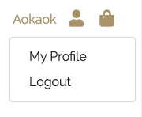

*As a site user I can save my personal details in my user profile so that I do not have to fill them out for future orders.*
- Users can fill in their personal details on their profile page. This information will be prepopulated for any future orders.
- When placing a new order, a checkbox under the delivery information can be checked to save the information just added.

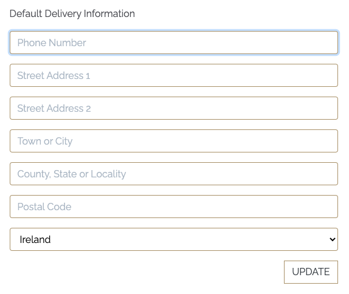

*As a site user I can view my order history so that I can remember what purchases I've made.*

- Once a user has created an account and placed an order, they can view the order history on their profile page.
- Clicking the order number will take you to a summary page of that order.

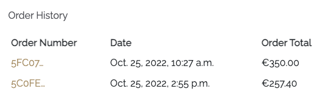

*As a site user I can recover my password in case I forget it so that I can recover access to my account.*
- On the sign-in page, a link to recover your password is located underneath the sign-in button. This uses the AllAuth functionality to reset the user's password. 

### EPIC | Purchasing
*As a shopper, I can add a number of products in different quantities to my shopping bag so that I can purchase them all together when I am ready.*

- Within the product detail page there is a quantity selector and an Add to Bag button. Shoppers can adjust the quantity by using the buttons located on either side of the input, or by typing in the amount.
- When the user clicks on the add to bag button, the chosen quantity of the product is added to the user's shopping bag.


*As a shopper I can view a running total of my shopping bag as I am shopping so that I can see how much it costs in total.*

- As the user adds products to their bag, a toast message appears in the top right-hand corner of the screen informing the user that the item has been added, giving them a snapshot of the bag contents and the total cost of the bag.

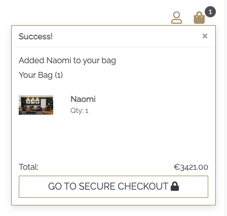

*As a shopper I can view the contents of my shopping bag at any time so I can see what is included and the total cost.*
- When the user clicks on the shopping bag icon in the nav bar they are taken to the shopping bag page which shows the products which the user has added to their cart, unit price, quantity and subtotal.
- The bottom of the page shows the bag total, delivery costs and then the grand total.

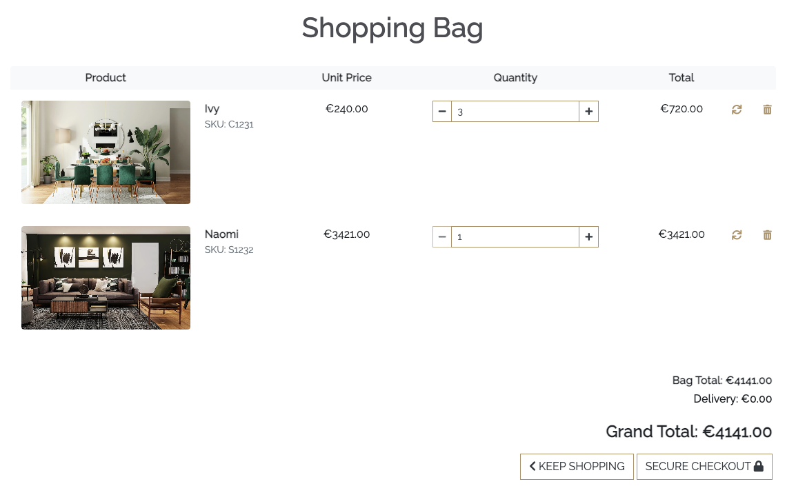

*As a shopper I can adjust the quantity of individual products in my bag so that I can easily make changes before I purchase.*
- When the user is viewing the shopping bag, they are able to adjust the quantity of each product line item and update the subtotal by clicking the update icon.
- The user is able to delete the product by clicking the bin icon and the bag should be updated accordingly.


*As a shopper, I can see a summary of my shopping cart when I checkout so that I know what products are included and the total cost before I commit to purchasing.*
- On the Checkout page the user can see a summary of the line items within their order including a thumbnail image, the product name, the quantity, the unit cost and the overall total order cost on the right-hand side.

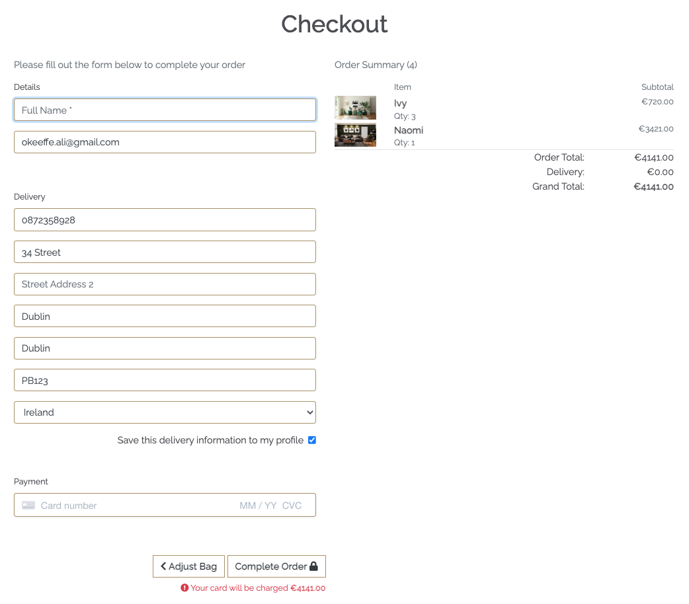

*As a shopper, I can easily enter my payment information securely so that I can purchase my chosen products quickly with no issues.*
- When the user navigates to the checkout page, they can see the Stripe Elements UI where they can enter their card details securely and pay for their order.
- The user receives feedback if the card number is valid/invalid.

*As a shopper checkout as a guest so I don't have to sign up for an account.*
- Shoppers do not need an account to purchase any items. Regardless of whether a user is signed in, the checkout process remains the same.
-  When the user completes the checkout form and presses submit their order should be completed.

*As a shopper, I can view an order confirmation after checkout so that I know my purchase was successful.*
- When the user submits the checkout form, they are redirected to a Checkout Success page where they can see an order confirmation and a summary of their order.

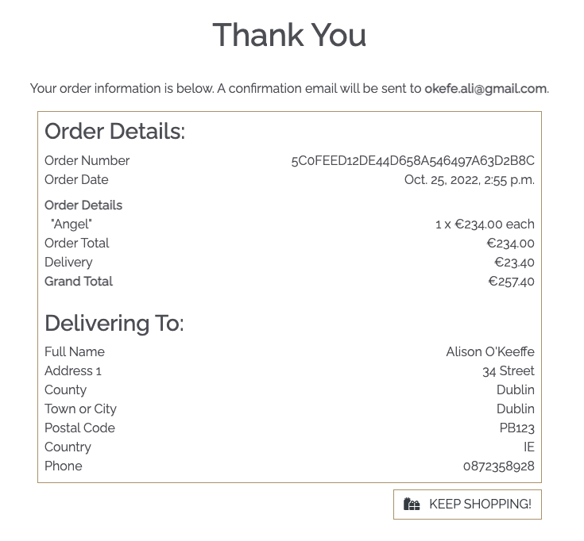

*As a shopper, I can receive an email confirmation of my order so that I have a record of my purchase.*
- When the user has submitted their order they will receive a confirmation email to the email address they entered in their order form containing all the details of the order.

### EPIC | Admin & Store Management
*As a store owner, I can add/edit/delete products through an easy-to-use interface so that I can manage the store's contents.*
- When the site owner is logged in, a Home Decor Management option appears in the User drop-down menu.
- When the site owner navigates to the Home Decor Management page they can add a new product to the store through a user-friendly form. 

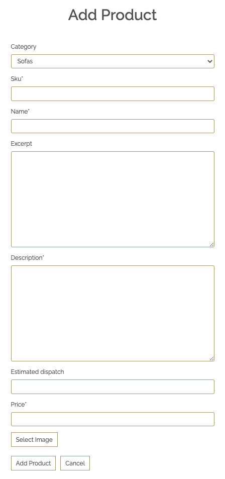
- The site owner is able to edit and delete products by clicking buttons on both the main Home Decor page and also the product detail page.
- The edit form is pre-populated with the product information.

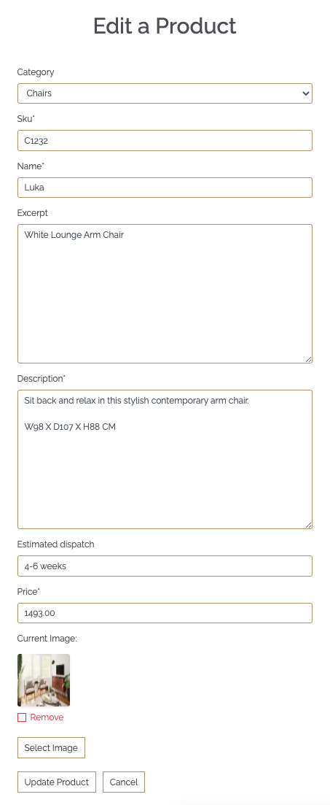
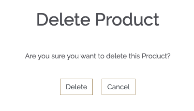

*As a site owner, I can add/edit/delete interior design services provided through an easy-to-use interface so that I can manage the site's contents.*
- When the site owner is logged in, a Design Service Management option appears in the User drop-down menu.
- When the site owner navigates to the Design Service Management page they can add a new design service to the site through a user-friendly form. 

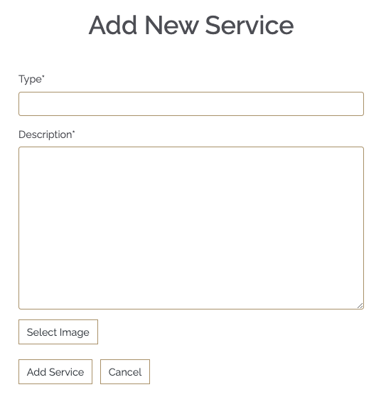
- The site owner is able to edit and delete services by clicking buttons on the Interior Design Services page.
-  The edit forms fields are pre-populated with all service information. 

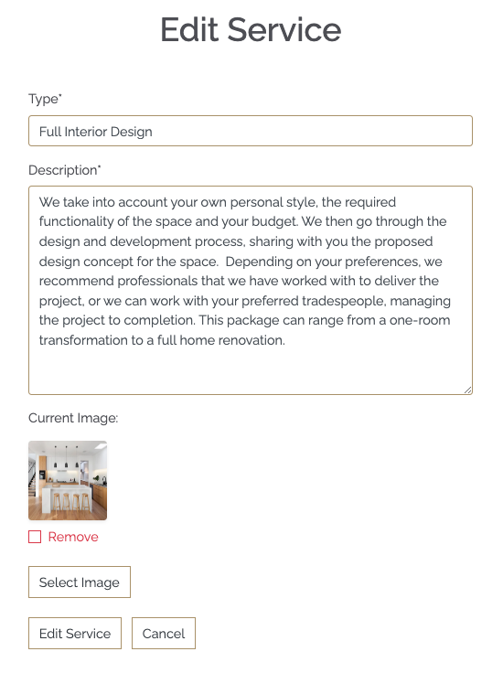


*As a site owner, I can add/delete images and location of previous design projects so that I can manage the site's contents.*
- When the site owner is logged in, a Previous Project Management option appears in the User drop-down menu.
- When the site owner navigates to the Previous Project Management page they can add details of a previous project to the site. through a user-friendly form. 


- The site owner is able to delete project images from the Previous Projects page by clicking the 'x' in the top right-hand corner of the picture.

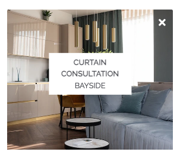

*As a site owner, I can view and delete customer enquiries on the front-end without having to access the admin panel.*
- When the site owner is logged in, an Enquiries Management option appears in the User drop-down menu.
- When the site owner navigates to the Enquiries Management page they can see a list of user enquiries sorted from newest to oldest.
- Emails that have been read are greyed out.


- When the site owner clicks on an enquiry they are taken to the individual enquiry detail.
- The site owner can choose to delete the enquiry or to go back to the list of enquiries.

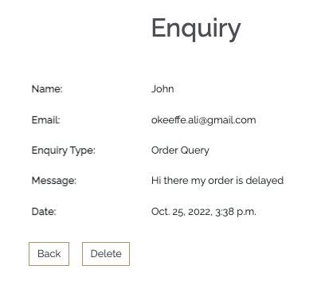

### EPIC | User Interaction
*As a site user, I can submit an enquiry form so that I can contact the site owner.*
- A user can open up the contact form by clicking on the "Enquire Now" button on the Interior Design Services page or by clicking the 'Contact' button in the Nav bar.
- The user can select the type of enquiry from a drop-down menu so that the site owner knows what the enquiry is about.
- If the user is logged in, their email address is prepopulated.
- When the form is submitted, the user receives an email confirmation of their enquiry so that they have a record of it.

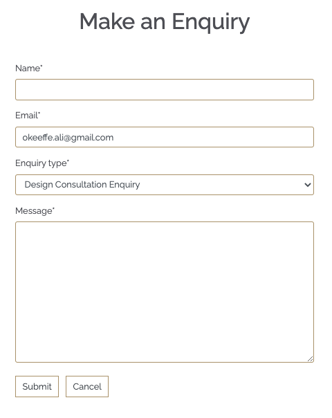

*As a site user, I can add / edit / delete a testimonial in relation to a consultation I received so that I can give my feedback.*
- When a logged-in user clicks on the "Add Testimonial" button on the Testimonials page, they can see a user-friendly form where they can add a new Testimonial to the site.

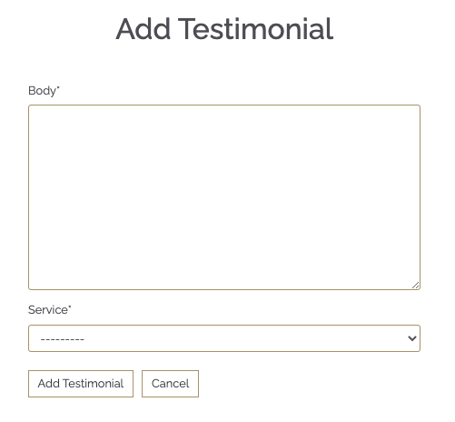
- If the user is not logged in they are redirected to the log-in page.
- The user is able to edit and delete their own testimonials from buttons on the Testimonials Page.
- The edit forms fields are pre-populated with testimonial information.

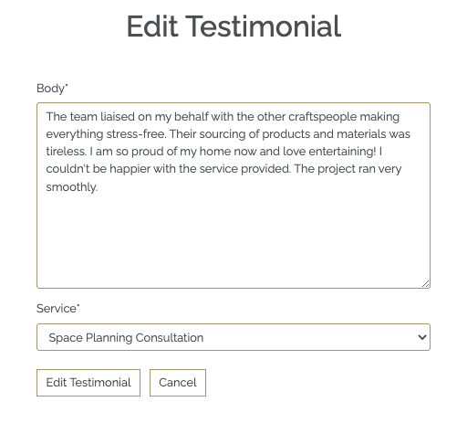
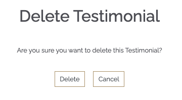
- The completed testimonial is automatically populated with the user's username and date underneath the body.


*As a user, I can sign up for the website's newsletter so that I can keep up to date with new products and promotions*
- In the footer is a 'Newsletter' section. Here the user can input their email address to sign up.


## Validator Testing

### HTML
All HTML pages were run through the [W3C HTML Validator](https://validator.w3.org/). See results in below table.

| Page                           | Logged Out | Logged In |
|--------------------------------|------------|-----------|
| Home                           | No Errors  | No Errors |
| Products                       | No Errors  | No Errors |
| Product Detail                 | No Errors  | No Errors |
| Add Product                    | N/A        | Note      |
| Edit Product                   | N/A        | Note      |
| Confirm Delete Product         | N/A        | No Errors |
| Bag                            | No Errors  | No Errors |
| Checkout                       | No Errors  | No Errors |
| Checkout Success               | No Errors  | No Errors |
| Profile                        | N/A        | No Errors |
| Order History                  | N/A        | No Errors |
| Interior Design Services       | No Errors  | No Errors |
| Add Interior Design Service    | N/A        | Note      |
| Edit Interior Design Service   | N/A        | Note      |
| Delete Interior Design Service | N/A        | No Errors |
| Interior Design Projects       | No Errors  | No Errors |
| Add Interior Design Project    | N/A        | Note      |
| Delete Interior Design         | N/A        | No Errors |
| Testimonials                   | No Errors  | No Errors |
| Add Testimonial                | N/A        | No Errors |
| Edit Testimonial               | N/A        | No Errors |
| Delete Testimonial             | N/A        | No Errors |
| Contact                        | No Errors  | No Errors |
| Enquiries Dashboard            | N/A        | No Errors |
| Enquiry Detail                 | N/A        | No Errors |
| Sign In                        | No Errors  | N/A       |
| Sign Up                        | No Errors  | N/A       |
| Log Out                        | N/A        | No Errors |
| Password Reset                 | No Errors  | N/A       |
| 400.html                       | No errors  | No errors |
| 403.html                       | N/A        | No errors |
| 404.html                       | No errors  | No errors |
| 500.html                       | No errors  | No errors |

Note: Image upload widget errors

All forms which include an image upload field show the same error below. This relates to the image upload widget on the form and thus changing the code breaks the field.

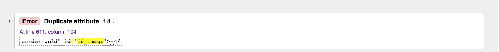

### CSS

No errors were found when passing my CSS files through the official [W3C CSS Validator](https://jigsaw.w3.org/css-validator/#validate_by_input)

*base.css*
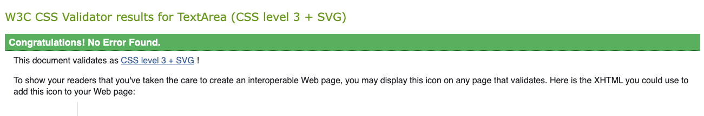

*checkout.css*
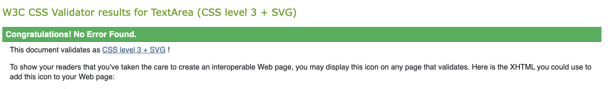

*profile.css*
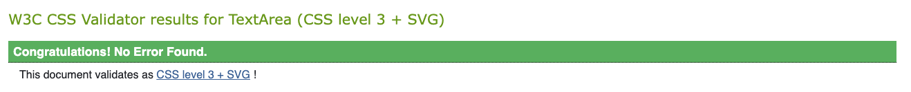


### JSHINT
All Javascript was passed through [Jshint](https://jshint.com/) with no issues.

**Base**

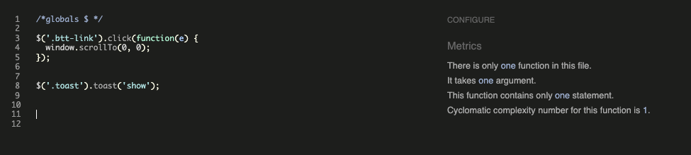

**Products**

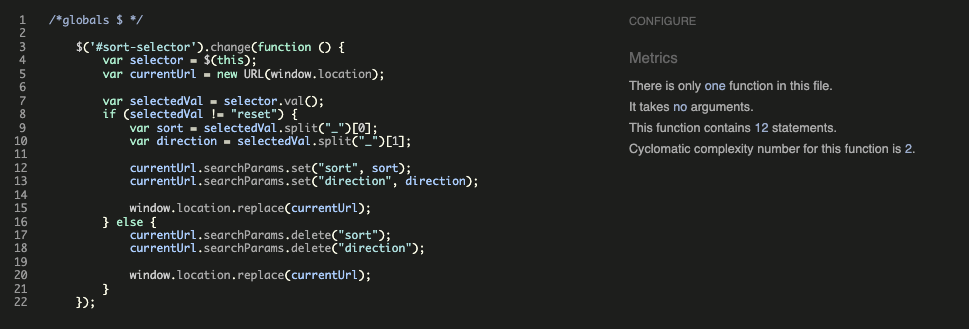

**Profile**

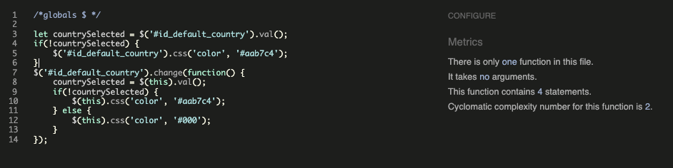

**Checkout**

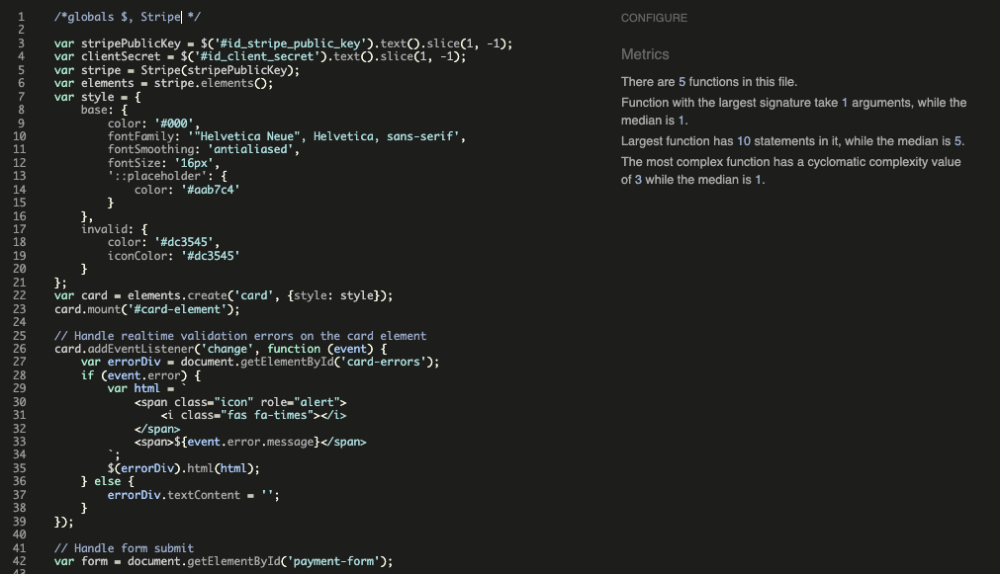

**Bag**

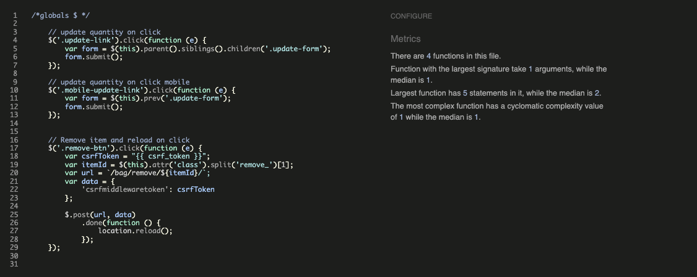

**Quantity Input**

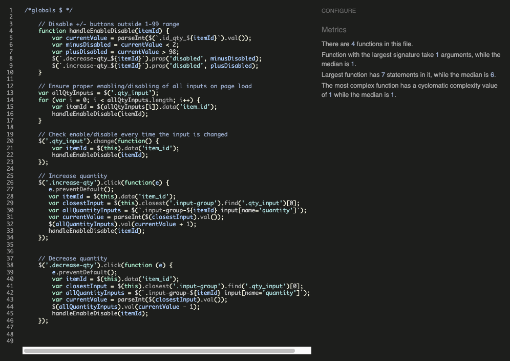

**Image Selector**

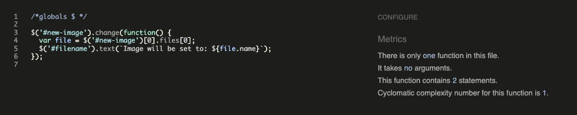


### Python Validation - Pycodestyle
Python testing was done using Pycodestyle to ensure there were no syntax errors.

The only errors displayed (as per below screenshot) can be ignored. The majority are within automatically generated files with the exception of env.py and webhooks.py. 

I have ignored the the formatting errors related to env.py as they relate to my Secret Keys and Database URL being to long. This file is not committed to github.

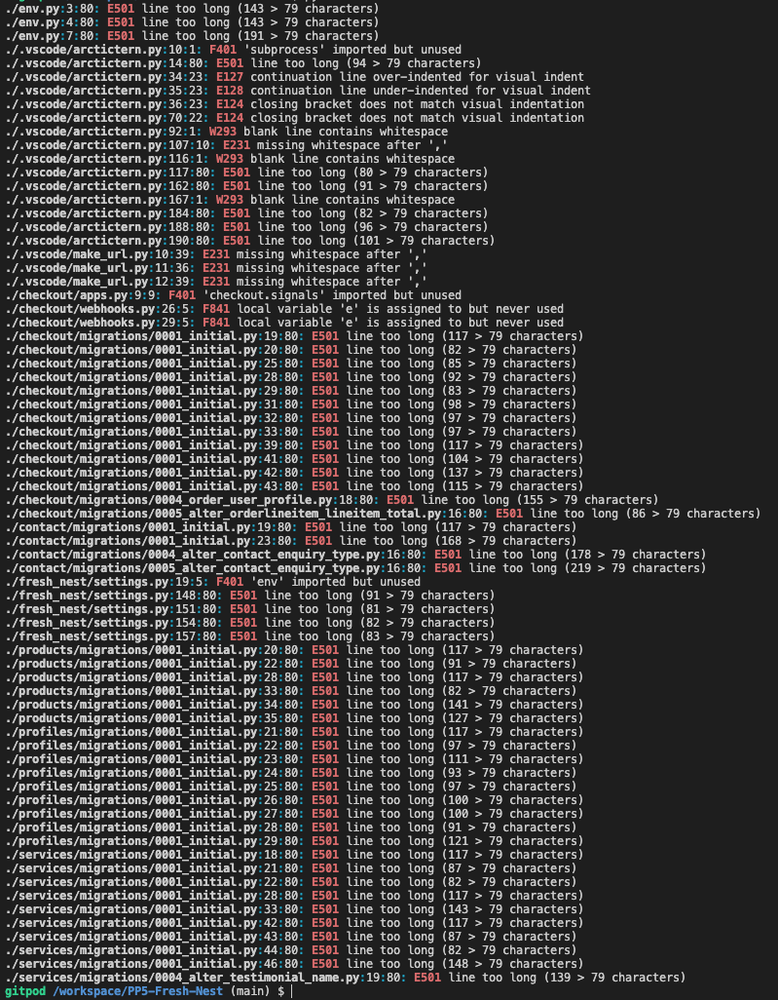

### Lighthouse

Lighthouse validation was run on all pages in order to check accessibility and performance. Many warnings were fixed including 'Background and foreground colours do not have a sufficient contrast ratio' and the below scores were achieved.

| Page                           | Performance  | Accessibility | Best Practices  | SEO |
|--------------------------------|:------------:|:-------------:|:---------------:|:---:|
|                                |              |               |                 |     |
| Desktop                        |              |               |                 |     |
| Home                           |           98 |           100 |             100 | 100 |
| Products                       |           98 |           100 |             100 | 100 |
| Product Detail                 |           98 |            98 |             100 | 100 |
| Add Product                    |           99 |           100 |             100 | 100 |
| Edit Product                   |           99 |           100 |             100 | 100 |
| Confirm Delete Product         |           99 |           100 |             100 | 100 |
| Bag                            |           98 |            98 |             100 | 100 |
| Checkout                       |           94 |            96 |             100 | 100 |
| Checkout Success               |           99 |            98 |             100 | 100 |
| Profile                        |           98 |           100 |             100 | 100 |
| Order History                  |           97 |            98 |             100 | 100 |
| Interior Design Services       |           99 |           100 |             100 | 100 |
| Add Interior Design Service    |           99 |           100 |             100 | 100 |
| Edit Interior Design Service   |           99 |           100 |             100 | 100 |
| Delete Interior Design Service |           99 |           100 |             100 | 100 |
| Interior Design Projects       |           99 |           100 |             100 | 100 |
| Add Interior Design Project    |           99 |           100 |             100 | 100 |
| Delete Interior Design         |           99 |           100 |             100 | 100 |
| Testimonials                   |           99 |            98 |             100 | 100 |
| Add Testimonial                |           99 |           100 |             100 | 100 |
| Edit Testimonial               |           99 |           100 |             100 | 100 |
| Delete Testimonial             |           99 |           100 |             100 | 100 |
| Contact                        |           99 |           100 |             100 | 100 |
| Enquiries Dashboard            |           99 |           100 |             100 | 100 |
| Enquiry Detail                 |           99 |           100 |             100 | 100 |
| Sign In                        |           99 |            98 |              98 | 100 |
| Sign Up                        |           99 |            98 |             100 | 100 |
| Log Out                        |           99 |           100 |             100 | 100 |
| Password Reset                 |           98 |           100 |             100 | 100 |


## Device Testing

The website was viewed on a variety of devices such as Desktop, Laptop, iPhone 8, iPhoneXR and iPad to ensure responsiveness on various screen sizes in both portrait and landscape mode. The website performed as intended. The responsive design was also checked using Chrome developer tools across multiple devices with structural integrity holding for the various sizes.

## Browser Testing

The Website was tested on Google Chrome, Firefox, Safari browsers with no issues noted.

## Manual Testing

### Site Navigation

| Element                          | Action                        | Expected Result                                              | Pass/Fail |
|----------------------------------|-------------------------------|--------------------------------------------------------------|-----------|
| NavBar                           |                               |                                                              |           |
| Site Name (logo area)            | Click                         | Redirect to home                                             | Pass      |
| Search Box Function              | Enter Text and Click Search   | Search both the product's title and description for a match. | Pass      |
| My Account Dropdown              | Click                         | Open profile dropdown                                        | Pass      |
| Sign Up Link                     | Click                         | Redirect to Sign Up page                                     | Pass      |
|                                  |                               | (Not visible if user in session)                             | Pass      |
| login Link                       | Click                         | Redirect to login page                                       | Pass      |
|                                  |                               | (Not visible if user in session)                             | Pass      |
| Home Decor Management Link       | Click                         | Redirect to add_product page                                 | Pass      |
|                                  |                               | (Only visible if superuser in session)                       | Pass      |
| Design Service Management Link   | Click                         | Redirect to add_service page                                 | Pass      |
|                                  |                               | (Only visible if superuser in session)                       | Pass      |
| Previous Project Management Link | Click                         | Redirect to add_project_image page                           | Pass      |
|                                  |                               | (Only visible if superuser in session)                       | Pass      |
| Enquiries Link                   | Click                         | Redirect to enquiries_dashboard page                         | Pass      |
|                                  |                               | (Only visible if superuser in session)                       | Pass      |
| My Profile Link                  | Click                         | Redirect to user profile page                                | Pass      |
|                                  |                               | (Only visible if user in session)                            | Pass      |
| Logout Link                      | Click                         | Redirect to logout confirm page                              | Pass      |
|                                  |                               | (Only visible if user in session)                            | Pass      |
| Bag Link                         | Click                         | Redirect to bag page                                         | Pass      |
|                                  |                               |                                                              |           |
| Mobile Top Header                |                               |                                                              |           |
| Search Icon Button               | Click                         | Open up search box                                           | Pass      |
| Search Box Function              | Enter Text and Click Search   | Search both the product's title and description for a match. | Pass      |
| My Account Dropdown              | Click                         | Open profile dropdown                                        | Pass      |
| Sign Up Link                     | Click                         | Redirect to Sign Up page                                     | Pass      |
|                                  |                               | (Not visible if user in session)                             | Pass      |
| login Link                       | Click                         | Redirect to login page                                       | Pass      |
|                                  |                               | (Not visible if user in session)                             | Pass      |
| Home Decor Management Link       | Click                         | Redirect to add_product page                                 | Pass      |
|                                  |                               | (Only visible if superuser in session)                       | Pass      |
| Design Service Management Link   | Click                         | Redirect to add_service page                                 | Pass      |
|                                  |                               | (Only visible if superuser in session)                       | Pass      |
| Previous Project Management Link | Click                         | Redirect to add_project_image page                           | Pass      |
|                                  |                               | (Only visible if superuser in session)                       | Pass      |
| Enquiries Link                   | Click                         | Redirect to enquiries_dashboard page                         | Pass      |
|                                  |                               | (Only visible if superuser in session)                       | Pass      |
| My Profile Link                  | Click                         | Redirect to user profile page                                | Pass      |
|                                  |                               | (Only visible if user in session)                            | Pass      |
| Logout Link                      | Click                         | Redirect to logout confirm page                              | Pass      |
|                                  |                               | (Only visible if user in session)                            | Pass      |
| Bag Link                         | Click                         | Redirect to bag page                                         | Pass      |
|                                  |                               |                                                              |           |
| Main Nav                         |                               |                                                              |           |
| Home Decor Dropdown              | Click                         | Open Home Decor dropdown                                     | Pass      |
| All Link                         | Click                         | Redirect all products page                                   | Pass      |
| Sofas Link                       | Click                         | Redirect to prints page filtered to sofas                    | Pass      |
| Chairs Link                      | Click                         | Redirect to prints page filtered to chairs                   | Pass      |
| Tables Link                      | Click                         | Redirect to prints page filtered to tables                   | Pass      |
| Lighting Link                    | Click                         | Redirect to prints page filtered to lighting                 | Pass      |
| Textiles Link                    | Click                         | Redirect to prints page filtered to textiles                 | Pass      |
| Interior Design Services Link    | Click                         | Open Interior Design Services Page                           | Pass      |
| Interior Design Projects Link    | Click                         | Open Interior Design Projects Page                           | Pass      |
| Testimonials Link                | Click                         | Open Testimonials Page                                       | Pass      |
| Contact Link                     | Click                         | Open Contact Page                                            | Pass      |
| Hamburger Menu                   | Responsive                    | Display when screen size reduces to medium size              | Pass      |
| Home Link                        | Click                         | Redirect to home                                             | Pass      |
|                                  |                               | (Only displays when screen size reduces to medium size       | Pass      |
| Footer                           |                               |                                                              |           |
| Social Media Icon Links          | Click                         | Open correct location in new tab                             | Pass      |
| Newsletter Email field           | Insert incorrect/empty format | On submit: form won't submit                                 | Pass      |
| Newsletter Email field           | Insert incorrect/empty format | Error message displays                                       | Pass      |
| Subscribe Button                 | Click                         | Form submit                                                  | Pass      |
| Subscribe Button                 | Click                         | Message appears saying Thank You for subscribing!            | Pass      |
| Home Decor Link                  | Click                         | Open Home Decor Page                                         | Pass      |
| Interior Design Services Link    | Click                         | Open Interior Design Services Page                           | Pass      |
| Contact Link                     | Click                         | Open Contact Page                                            | Pass      |
| Client Testimonials Link         | Click                         | Open Testimonials Page                                       | Pass      |
| Privacy Policy Link              | Click                         | Open Privacy Policy Page in new tab                          | Pass      |
| Sponsor Image Links              | Click                         | Open correct location in new tab                             | Pass      |


### Home Page

| Element                | Action | Expected Result                    | Pass/Fail |
|------------------------|--------|------------------------------------|-----------|
| Shop Now Button        | Click  | Open Home Decor Page               | Pass      |
| Design Services Button | Click  | Open Interior Design Services Page | Pass      |


### All Auth Pages 

| Element                         | Action                                    | Expected Result                              | Pass/Fail |
|---------------------------------|-------------------------------------------|----------------------------------------------|-----------|
| Sign Up                         |                                           |                                              |           |
| Sign in link                    | Click                                     | Redirect to sign in page                     | Pass      |
| Email field                     | Insert incorrect format                   | On submit: form won't submit                 | Pass      |
| Email field                     | Insert incorrect format                   | Error message displays                       | Pass      |
| Email field                     | Insert correct format                     | On submit: form submit                       | Pass      |
| Email field                     | Leave empty                               | On submit: form won't submit                 | Pass      |
| Email field                     | Insert duplicate email                    | On submit: form won't submit                 | Pass      |
| Email field                     | Insert duplicate email                    | Error message displays                       | Pass      |
| Email Confirmation field        | Insert different email                    | On submit: form won't submit                 | Pass      |
| Email Confirmation field        | Insert different email                    | Error message displays                       | Pass      |
| Username field                  | Leave empty/incorrect format              | On submit: form won't submit                 | Pass      |
| Username field                  | Leave empty/incorrect format              | Error message displays                       | Pass      |
| Username field                  | Insert correct format                     | On submit: form submit                       | Pass      |
| Username field                  | Insert duplicate username                 | On submit: form won't submit                 | Pass      |
| Username field                  | Insert duplicate username                 | Error message displays                       | Pass      |
| Password field                  | Insert incorrect format/length            | On submit: form won't submit                 | Pass      |
| Password field                  | Insert incorrect format/length            | Error message displays                       | Pass      |
| Password field                  | Passwords don't match                     | On submit: form won't submit                 | Pass      |
| Password field                  | Passwords don't match                     | Error message displays                       | Pass      |
| Password field                  | Insert correct format and passwords match | On submit: form submit                       | Pass      |
| Sign Up button(form valid)      | Click                                     | Form submit                                  | Pass      |
| Sign Up button(form valid)      | Click                                     | Redirect to Verify Email Address page        | Pass      |
| Sign Up button(form valid)      | Click                                     | Alert message confirming email sent appears  | Pass      |
| Confirmation Email Confirm Link | Click                                     | Open Confirm Email Address Page              | Pass      |
| Confirm Button                  | Click                                     | Success message confirming new user appears  | Pass      |
| Confirm Button                  | Click                                     | Redirect to sign in page                     | Pass      |
|                                 |                                           |                                              |           |
| Log in                          |                                           |                                              |           |
| Sign up link                    | Click                                     | Redirect to sign up page                     | Pass      |
| Username field                  | Leave empty                               | On submit: form won't submit                 | Pass      |
| Username field                  | Leave empty                               | Error message displays                       | Pass      |
| Username field                  | Insert wrong username                     | On submit: form won't submit                 | Pass      |
| Username field                  | Insert wrong username                     | Error message displays                       | Pass      |
| Password field                  | Leave empty                               | On submit: form won't submit                 | Pass      |
| Password field                  | Leave empty                               | Error message displays                       | Pass      |
| Password field                  | Insert wrong password                     | On submit: form won't submit                 | Pass      |
| Password field                  | Insert wrong password                     | Error message displays                       | Pass      |
| Login button(form valid)        | Click                                     | Form submit                                  | Pass      |
| Login button(form valid)        | Click                                     | Redirect to home page                        | Pass      |
| Login button(form valid)        | Click                                     | Success message confirming login appears     | Pass      |
| Forgot Password Link            | Click                                     | Redirect to Password Reset page              | Pass      |
| Email field                     | Leave empty/incorrect format              | On submit: form submit                       | Pass      |
| Reset My Password Button        | Click                                     | Confirmation message that email sent         | Pass      |
| Password Reset Email Link       | Click                                     | Open Change Password Page                    | Pass      |
| Change Password Button          | Click                                     | Success message confirming Password Changed  | Pass      |
|                                 |                                           |                                              |           |
| Sign Out Confirmation           |                                           |                                              |           |
| Sign Out  button                | Click                                     | Redirect to homepage                         | Pass      |
| Sign Out  button                | Click                                     | Success message confirming Sign Out  appears | Pass      |


### Home Decor

| Element                         | Action  | Expected Result                                                                                | Pass/Fail |
|---------------------------------|---------|------------------------------------------------------------------------------------------------|-----------|
| Sort By' Dropdown               | Click   | Open 'sort by' options                                                                         | Pass      |
| Sort By' Options (x3)           | Click   | Re-order products correctly                                                                    | Pass      |
| If Category Selected            | Display | Pages heading changes to show category name                                                    | Pass      |
| Product Number                  | Display | Displays correct number of products on page                                                    | Pass      |
| Product Card                    | Hover   | Change card opacity                                                                            | Pass      |
| Product Card                    | Click   | Redirect to product detail page                                                                | Pass      |
| If Searched Product             | Display | Only display products with search term in either the product's title or description or excerpt | Pass      |
| If Searched Product             | Display | Display number of products found for " searched product"                                       | Pass      |
| If Superuser in session:        |         |                                                                                                |           |
| Add New Product Button          | Click   | Redirect to add product page                                                                   | Pass      |
| Edit product link               | Click   | Redirect to edit product page                                                                  | Pass      |
| Delete product link             | Click   | Open delete confirmation  page                                                                 | Pass      |
| Confirm Delete -  cancel button | Click   | Redirect to home decor page                                                                    | Pass      |
| Confirm Delete -  delete button | Click   | Delete product                                                                                 | Pass      |
| Confirm Delete -  delete button | Click   | Success message appears confirming product deleted successfully                                | Pass      |


### Product Detail

| Element                  | Action                    | Expected Result                                                                              | Pass/Fail |
|--------------------------|---------------------------|----------------------------------------------------------------------------------------------|-----------|
| Product Content          | Display                   | Display correct product image, excerpt, price, product details and dispatch time frame       | Pass      |
| Qty control buttons      | Click                     | Increase/decrease quantity                                                                   | Pass      |
| Qty control buttons      | Click                     | Minus button disabled if quantity is 1                                                       | Pass      |
| Qty control buttons      | Click                     | Plus button disabled if quantity is 99                                                       | Pass      |
| Qty control buttons      | Manually Input  <1 or >99 | If quantity >99 or <1 manually entered, error message appears when Add to Bag button clicked | Pass      |
| Keep Shopping button     | Click                     | Redirect to home decor page                                                                  | Pass      |
| Add to bag button        | Click                     | Add item to bag                                                                              | Pass      |
| Add to bag button        | Click                     | Toast Success appears                                                                        | Pass      |
| Add to bag button        | Click                     | Product and quantity visible in toast success                                                | Pass      |
| If Superuser in session: |                           |                                                                                              |           |
| Edit product link        | Click                     | Redirect to edit product page                                                                | Pass      |
| Delete product link      | Click                     | Open delete confirmation  page                                                               | Pass      |

### Home Decor Management 

| Element                         | Action                | Expected Result                                                                                                            | Pass/Fail |
|---------------------------------|-----------------------|----------------------------------------------------------------------------------------------------------------------------|-----------|
| Add Product                     | Access                | If a user tries to add a product (by changing the url) without being signed in they are redirected to the login page       | Pass      |
| Add Product                     | Access                | If a user tries to add a product (by changing the url) without being superuser they are redirected to a custom 403 page    | Pass      |
| Form Text Input (if required)   | Leave blank           | On Submit: Warning appears, form won't submit                                                                              | Pass      |
| Form Text Input (if required)   | Just input whitespace | On Submit: Form won't submit                                                                                               | Pass      |
| SKU                             | Duplicate Entry       | On Submit: Warning appears, form won't submit                                                                              | Pass      |
| Form image select button        | Click                 | Open device storage                                                                                                        | Pass      |
| Form image select button        | Display               | Chosen image name displayed once selected                                                                                  | Pass      |
| Form image select button        | Display               | Default image is used if no image is selected                                                                              | Pass      |
| Cancel button                   | Click                 | Redirect to Home Decor page                                                                                                | Pass      |
| Add Product button(form valid)  | Click                 | Form submit                                                                                                                | Pass      |
| Add Product button(form valid)  | Click                 | Redirect to Product detail page for new product with all information displaying correctly                                  | Pass      |
| Add Product button(form valid)  | Click                 | Success message appears informing the superuser that the product has been added                                            | Pass      |
|                                 |                       |                                                                                                                            |           |
|                                 |                       |                                                                                                                            |           |
| Edit Product                    |                       |                                                                                                                            |           |
| Element                         | Action                | Expected Result                                                                                                            | Pass/Fail |
| Edit Product                    | Access                | If a user tries to add a product (by changing the url) without being signed in they are redirected to the login page       | Pass      |
| Edit Product                    | Access                | If a user tries to add a product (by changing the url) without being superuser they are redirected to a custom 403 page    | Pass      |
| Edit Product Form               | Display               | Form has all the fields filled out with the original content                                                               | Pass      |
| Edit Product Form               | Image Field           | Thumbnail of original image is shown                                                                                       | Pass      |
| Form Text Input (if required)   | Leave blank           | On Submit: Warning appears, form won't submit                                                                              | Pass      |
| Form Text Input (if required)   | Just input whitespace | On Submit: Form won't submit                                                                                               | Pass      |
| Cancel button                   | Click                 | Redirect to Home Decor page                                                                                                | Pass      |
| Submit button(form valid)       | Click                 | Form submit                                                                                                                | Pass      |
| Edit Product button(form valid) | Click                 | Redirect to Product detail page for new product with all information displaying correctly                                  | Pass      |
| Edit Product button(form valid) | Click                 | Success message appears informing the superuser that the product has been updated                                          | Pass      |
|                                 |                       |                                                                                                                            |           |
| Confirm Delete Product          | Action                | Expected Result                                                                                                            | Pass/Fail |
| Delete Product                  | Access                | If a user tries to Delete a product (by changing the url) without being signed in they are redirected to the login page    | Pass      |
| Delete Product                  | Access                | If a user tries to Delete a product (by changing the url) without being superuser they are redirected to a custom 403 page | Pass      |
| Confirm Delete -  cancel button | Click                 | Redirect to home decor page                                                                                                | Pass      |
| Confirm Delete -  delete button | Click                 | Delete product                                                                                                             | Pass      |
| Confirm Delete -  delete button | Click                 | Success message appears confirming product deleted successfully                                                            | Pass      |

### Bag

| Element                                                       | Action              | Expected Result                                        | Pass/Fail |
|---------------------------------------------------------------|---------------------|--------------------------------------------------------|-----------|
| No Bag Items                                                  |                     |                                                        |           |
| Keep Shopping button                                          | Click               | Redirect to home decor page                            | Pass      |
| Bag Items                                                     |                     |                                                        |           |
| Qty control buttons                                           | Click               | Increase/decrease quantity                             | Pass      |
| Qty control buttons                                           | Click               | Minus button disabled if quantity is 1                 | Pass      |
| Qty control buttons                                           | Click               | Plus button disabled if quantity is 99                 | Pass      |
| Qty control buttons                                           | Manually Input  >99 | Error message appears when refresh button is clicked   | Pass      |
| Qty control buttons                                           | Manually Input  <1  | Shopping bag is emptied when refresh button is clicked | Pass      |
| Refresh Icon button                                           | Click               | Update bag item quantity                               | Pass      |
| Refresh Icon button                                           | Refresh Icon button | Updated confirmation toast appears                     | Pass      |
| Bin Icon button                                               | Click               | Remove item from bag                                   | Pass      |
| Bin Icon button                                               | Click               | Removed confirmation toast appears                     | Pass      |
| Line item subtotal / Bag total / Delivery cost / Grand Total  | Calculate           | All numbers are calculated correctly                   | Pass      |
| Continue shopping button                                      | Click               | Redirect to products page                              | Pass      |
| Secure Checkout button                                        | Click               | Redirect to checkout page                              | Pass      |

### Checkout

| Element                             | Action                          | Expected Result                                                     | Pass/Fail |
|-------------------------------------|---------------------------------|---------------------------------------------------------------------|-----------|
| Checkout Page                       | Direct URL input (empty bag)    | redirect to products page                                           | Pass      |
| Checkout Page                       | Direct URL input (empty bag)    | empty bag toast appears                                             | Pass      |
| Form fields(if user logged in)      | On load                         | fields populated with user default info(if previously saved)        | Pass      |
| Text Input(if required)             | Leave blank                     | On submit:form won't submit                                         | Pass      |
| Text Input(if required)             | Leave blank                     | error message on invalid field(s)                                   | Pass      |
| Text Input(if required)             | Just whitespace                 | On submit:form won't submit                                         | Pass      |
| Text Input(if required)             | Just whitespace                 | error message on invalid field(s)                                   | Pass      |
| Text Input(if required)             | Fill in correctly               | On submit: form submits                                             | Pass      |
| Phone number Input                  | Leave blank                     | On submit:form won't submit                                         | Pass      |
| Phone number Input                  | Leave blank                     | error message on field                                              | Pass      |
| Phone number Input                  | Just whitespace                 | On submit:form won't submit                                         | Pass      |
| Phone number Input                  | Just whitespace                 | error message on field                                              | Pass      |
| Phone number Input                  | Use non numeric characters      | On submit:form won't submit                                         | Pass      |
| Phone number Input                  | Use non numeric characters      | error message on field                                              | Pass      |
| Email Input                         | Leave blank                     | On submit:form won't submit                                         | Pass      |
| Email Input                         | Leave blank                     | error message on field                                              | Pass      |
| Email Input                         | Just whitespace                 | On submit:form won't submit                                         | Pass      |
| Email Input                         | Just whitespace                 | error message on field                                              | Pass      |
| Email Input                         | Fill in correctly               | On submit: form submits                                             | Pass      |
| Form Dropdown                       | Click                           | Show dropdown options                                               | Pass      |
| Save to profile checkbox            | On load(user logged in)         | Shown                                                               | Pass      |
| Save to profile checkbox            | On load(user not logged in)     | Not shown                                                           | Pass      |
| Save to profile checkbox            | Checked                         | On submit:Delivery information saved to user profile                | Pass      |
| Save to profile checkbox            | Unchecked                       | On submit:Delivery information not saved to user profile            | Pass      |
| Payment card input                  | Input invalid card number       | Error message on field                                              | Pass      |
| Payment card input                  | Input invalid date              | Error message on field                                              |           |
| Adjust Bag button                   | Click                           | Redirect to bag page                                                | Pass      |
| Complete Order button(form invalid) | Click                           | Form won't submit                                                   | Pass      |
| Complete Order button(form invalid) | Click                           | Error message on invalid fields                                     | Pass      |
| Complete Order button(form valid)   | Payment succeeds                | loading screen reappears                                            | Pass      |
| Complete Order button(form valid)   | Payment succeeds                | form submits                                                        | Pass      |
| Complete Order button(form valid)   | Payment succeeds                | redirect to order confirmation page                                 | Pass      |
| Complete Order button(form valid)   | (if user logged in)             | order saved to user profile                                         | Pass      |
| Complete Order button(form valid)   | Payment failed                  | Loading animation appears                                           | Pass      |
| Complete Order button(form valid)   | Payment failed                  | form won't submit                                                   | Pass      |
| Complete Order button(form valid)   | Payment failed                  | error message at bottom of form                                     | Pass      |
| Complete Order button(form valid)   | Click                           | Success message appears confirming order successfully processed     | Pass      |
| Complete Order button(form valid)   | Payment Requires authentication | Authentication box appears                                          | Pass      |
| Fail Authentication button          | Click                           | Authentication box closes                                           | Pass      |
| Fail Authentication button          | Click                           | User directed back to form                                          | Pass      |
| Fail Authentication button          | Click                           | error message at bottom of form                                     | Pass      |
| Complete Authentication button      | Click                           | loading screen reappears                                            | Pass      |
| Complete Authentication button      | Click                           | form submits                                                        | Pass      |
| Complete Authentication button      | Click                           | redirect to order confirmation page                                 | Pass      |
| Complete Order button(form valid)   | Click                           | Success message appears confirming order successfully processed     | Pass      |
| Complete Order button(form valid)   | Click                           | User receives an order confirmation email with correct information  | Pass      |
|                                     |                                 |                                                                     |           |
| Checkout Success Page               |                                 |                                                                     |           |
| Element                             | Action                          | Expected Result                                                     | Pass/Fail |
| Order Confirmation                  | Display                         | Display Correct Order Details                                       | Pass      |
| Keep Shopping! button               | Click                           | Redirect to products page                                           | Pass      |

### Profile

| Element                | Action            | Expected Result                                                                                                                | Pass/Fail |
|------------------------|-------------------|--------------------------------------------------------------------------------------------------------------------------------|-----------|
| Open Profile Page      | Access            | If a user tries to access the profile page (by changing the url) without being signed in they are redirected to the login page | Pass      |
| Form fields            | On load           | fields populated with user default info(if previously saved)                                                                   | Pass      |
| All input fields       | Leave blank       | On submit: form submits                                                                                                        | Pass      |
| All input fields       | Just whitespace   | On submit: form submits                                                                                                        | Pass      |
| All input fields       | Fill in correctly | On submit: form submits                                                                                                        | Pass      |
| Form Dropdown          | Click             | Show dropdown options                                                                                                          | Pass      |
| Update button          | Click             | Form submits                                                                                                                   | Pass      |
| Update button          | Click             | Success message appears confirming profile successfully updated                                                                | Pass      |
| Previous order number  | Click             | Redirect to previous order page                                                                                                | Pass      |
|                        |                   |                                                                                                                                |           |
| Previous Order Page    |                   |                                                                                                                                |           |
| Element                | Action            | Expected Result                                                                                                                | Pass/Fail |
| Information Display    | Display           | All previous order information displays correctly                                                                              | Pass      |
| Toast                  | On load           | Previous order info toast appears                                                                                              | Pass      |
| Back to Profile button | Click             | Redirect to profile page                                                                                                       | Pass      |


### Interior Design Services

| Element                  | Action  | Expected Result                                 | Pass/Fail |
|--------------------------|---------|-------------------------------------------------|-----------|
| Service Content          | Display | Display correct service image, type and content | Pass      |
| Enquire Now button       | Click   | Open Contact page                               | Pass      |
| If Superuser in session: |         |                                                 |           |
| Edit service link        | Click   | Redirect to edit service page                   | Pass      |
| Delete service link      | Click   | Open delete confirmation  page                  | Pass      |

### Interior Design Management

| Add Service                     |                       |                                                                                                                            |           |
|---------------------------------|-----------------------|----------------------------------------------------------------------------------------------------------------------------|-----------|
| Element                         | Action                | Expected Result                                                                                                            | Pass/Fail |
| Add Service                     | Access                | If a user tries to add a service (by changing the url) without being signed in they are redirected to the login page       | Pass      |
| Add Service                     | Access                | If a user tries to add a service (by changing the url) without being superuser they are redirected to a custom 403 page    | Pass      |
| Form Text Input (if required)   | Leave blank           | On Submit: Warning appears, form won't submit                                                                              | Pass      |
| Form Text Input (if required)   | Just input whitespace | On Submit: Form won't submit                                                                                               | Pass      |
| Form image select button        | Click                 | Open device storage                                                                                                        | Pass      |
| Form image select button        | Display               | Chosen image name displayed once selected                                                                                  | Pass      |
| Form image select button        | Display               | Default image is used if no image is selected                                                                              | Pass      |
| Cancel button                   | Click                 | Redirect to Interior Design Services page                                                                                  | Pass      |
| Add Service button(form valid)  | Click                 | Form submit                                                                                                                | Pass      |
| Add Service button(form valid)  | Click                 | Redirect to Interior Design Services Page with all information displaying correctly                                        | Pass      |
| Add Service button(form valid)  | Click                 | Success message appears informing the superuser that the service has been added                                            | Pass      |
|                                 |                       |                                                                                                                            |           |
| Edit Service                    |                       |                                                                                                                            |           |
| Element                         | Action                | Expected Result                                                                                                            | Pass/Fail |
| Edit Service                    | Access                | If a user tries to edit a service (by changing the url) without being signed in they are redirected to the login page      | Pass      |
| Edit Service                    | Access                | If a user tries to edit a service (by changing the url) without being superuser they are redirected to a custom 403 page   | Pass      |
| Edit Service Form               | Display               | Form has all the fields filled out with the original content                                                               | Pass      |
| Edit Service Form               | Image Field           | Thumbnail of original image is shown                                                                                       | Pass      |
| Form Text Input (if required)   | Leave blank           | On Submit: Warning appears, form won't submit                                                                              | Pass      |
| Form Text Input (if required)   | Just input whitespace | On Submit: Form won't submit                                                                                               | Pass      |
| Cancel button                   | Click                 | Redirect to Interior Design Services page                                                                                  |           |
| Submit button(form valid)       | Click                 | Form submit                                                                                                                | Pass      |
| Edit Service button(form valid) | Click                 | Redirect to Interior Design Services Page with all information displaying correctly                                        | Pass      |
| Edit Service button(form valid) | Click                 | Success message appears informing the superuser that the service has been edited                                           | Pass      |
|                                 |                       |                                                                                                                            |           |
| Confirm Delete Service          |                       |                                                                                                                            |           |
| Element                         | Action                | Expected Result                                                                                                            | Pass/Fail |
| Delete Service                  | Access                | If a user tries to Delete a service (by changing the url) without being signed in they are redirected to the login page    | Pass      |
| Delete Service                  | Access                | If a user tries to Delete a service (by changing the url) without being superuser they are redirected to a custom 403 page | Pass      |
| Confirm Delete -  cancel button | Click                 | Redirect to Interior Design Services page                                                                                  | Pass      |
| Confirm Delete -  delete button | Click                 | Delete Service from database                                                                                               | Pass      |
| Confirm Delete -  delete button | Click                 | Success message appears confirming service deleted successfully                                                            | Pass      |


Interior Design Projects

| Element                  | Action  | Expected Result                           | Pass/Fail |
|--------------------------|---------|-------------------------------------------|-----------|
| Previous Project Content | Display | Display correct image and location        | Pass      |
| Project Card             | Hover   | Display Service Type and Project location | Pass      |
| If Superuser in session: |         |                                           |           |
| Delete project button    | Display | In top right corner of image              | Pass      |
| Delete project button    | Click   | Open delete confirmation  page            | Pass      |


Interior Design Projects Management

| Add Previous Project            |                       |                                                                                                                            |           |
|---------------------------------|-----------------------|----------------------------------------------------------------------------------------------------------------------------|-----------|
| Element                         | Action                | Expected Result                                                                                                            | Pass/Fail |
| Add Previous Project            | Access                | If a user tries to add a project (by changing the url) without being signed in they are redirected to the login page       | Pass      |
| Add Previous Project            | Access                | If a user tries to add a project (by changing the url) without being superuser they are redirected to a custom 403 page    | Pass      |
| Form Text Input (if required)   | Leave blank           | On Submit: Warning appears, form won't submit                                                                              | Pass      |
| Form Text Input (if required)   | Just input whitespace | On Submit: Form won't submit                                                                                               | Pass      |
| Service Dropdown                | Click                 | Display all Interior Design Services in Database                                                                           | Pass      |
| Form image select button        | Click                 | Open device storage                                                                                                        | Pass      |
| Form image select button        | Display               | Chosen image name displayed once selected                                                                                  | Pass      |
| Form image select button        | Leave blank           | On Submit: Warning appears, form won't submit                                                                              | Pass      |
| Cancel button                   | Click                 | Redirect to Interior Design Projects page                                                                                  | Pass      |
| Add Project button(form valid)  | Click                 | Form submit                                                                                                                | Pass      |
| Add Project button(form valid)  | Click                 | Redirect to Interior Design Projects Page with all information displaying correctly                                        | Pass      |
| Add Project button(form valid)  | Click                 | Success message appears informing the superuser that the project has been added                                            | Pass      |
|                                 |                       |                                                                                                                            |           |
| Confirm Delete Project Image    |                       |                                                                                                                            |           |
| Element                         | Action                | Expected Result                                                                                                            | Pass/Fail |
| Delete Previous Project         | Access                | If a user tries to delete a project (by changing the url) without being signed in they are redirected to the login page    | Pass      |
| Delete Previous Project         | Access                | If a user tries to delete a project (by changing the url) without being superuser they are redirected to a custom 403 page | Pass      |
| Confirm Delete -  cancel button | Click                 | Redirect to Interior Design Projects page                                                                                  | Pass      |
| Confirm Delete -  delete button | Click                 | Delete Interior Design Projects  from database                                                                             | Pass      |
| Confirm Delete -  delete button | Click                 | Success message appears confirming Interior Design Projects  deleted successfully                                          | Pass      |


### Testimonials

| Element                 | Action  | Expected Result                                                                    | Pass/Fail |
|-------------------------|---------|------------------------------------------------------------------------------------|-----------|
| Testimonial Content     | Display | Display correct testimonial content, service type, author and date                 | Pass      |
| Add Testimonial button  | Click   | Open Add testimonial form                                                          | Pass      |
| Edit testimonial link   | Display | Only display if user is the author of the testimonial or if they are the superuser | Pass      |
| Edit testimonial link   | Click   | Redirect to edit testimonial page                                                  | Pass      |
| Delete Testimonial link | Display | Only display if user is the author of the testimonial                              | Pass      |
| Delete service link     | Click   | Open delete confirmation  page                                                     | Pass      |


### Testimonial Management

| Add Testimonial                     |                       |                                                                                                                             |           |
|-------------------------------------|-----------------------|-----------------------------------------------------------------------------------------------------------------------------|-----------|
| Element                             | Action                | Expected Result                                                                                                             | Pass/Fail |
| Add Testimonial                     | Access                | If a user tries to add a testimonial (by changing the url) without being signed in they are redirected to the login page    | Pass      |
| Form Text Input (if required)       | Leave blank           | On Submit: Warning appears, form won't submit                                                                               | Pass      |
| Form Text Input (if required)       | Just input whitespace | On Submit: Form won't submit                                                                                                | Pass      |
| Service Dropdown                    | Click                 | Display all Interior Design Services in Database                                                                            | Pass      |
| Cancel button                       | Click                 | Redirect to Testimonials page                                                                                               |           |
| Add Testimonial button(form valid)  | Click                 | Form submit                                                                                                                 | Pass      |
| Add Testimonial button(form valid)  | Click                 | Redirect to Testimonials Page with all information displaying correctly                                                     | Pass      |
| Add Testimonial button(form valid)  | Click                 | Success message appears informing the superuser that the testimonial has been added                                         | Pass      |
|                                     |                       |                                                                                                                             |           |
|                                     |                       |                                                                                                                             |           |
| Edit Testimonial                    |                       |                                                                                                                             |           |
| Element                             | Action                | Expected Result                                                                                                             | Pass/Fail |
| Edit Testimonial                    | Access                | If a user tries to edit a Testimonial (by changing the url) without being signed in they are redirected to the login page   | Pass      |
| Edit Testimonial                    | Access                | If a user tries to edit another user's Testimonial (by changing the url) they are redirected to a custom 403 page           | Pass      |
| Edit Testimonial Form               | Display               | Form has all the fields filled out with the original content                                                                | Pass      |
| Form Text Input (if required)       | Leave blank           | On Submit: Warning appears, form won't submit                                                                               | Pass      |
| Form Text Input (if required)       | Just input whitespace | On Submit: Form won't submit                                                                                                | Pass      |
| Cancel button                       | Click                 | Redirect to Testimonials page                                                                                               |           |
| Submit button(form valid)           | Click                 | Form submit                                                                                                                 | Pass      |
| Edit Testimonial button(form valid) | Click                 | Redirect to Testimonials Page with all information displaying correctly                                                     | Pass      |
| Edit Testimonial button(form valid) | Click                 | Success message appears informing the superuser that the testimonial has been edited                                        | Pass      |
|                                     |                       |                                                                                                                             |           |
|                                     |                       |                                                                                                                             |           |
| Confirm Delete Testimonial          |                       |                                                                                                                             |           |
| Element                             | Action                | Expected Result                                                                                                             | Pass/Fail |
| Delete Testimonial                  | Access                | If a user tries to delete a Testimonial (by changing the url) without being signed in they are redirected to the login page | Pass      |
| Delete Testimonial                  | Access                | If a user tries to delete another user's Testimonial (by changing the url) they are redirected to a custom 403 page         | Pass      |
| Confirm Delete -  cancel button     | Click                 | Redirect to Testimonials page                                                                                               | Pass      |
| Confirm Delete -  delete button     | Click                 | Delete Testimonial  from database                                                                                           | Pass      |
| Confirm Delete -  delete button     | Click                 | Success message appears confirming Testimonial  deleted successfully                                                        | Pass      |

### Contact

| Element                       | Action                | Expected Result                                                                     | Pass/Fail |
|-------------------------------|-----------------------|-------------------------------------------------------------------------------------|-----------|
| Form Text Input (if required) | Leave blank           | On Submit: Warning appears, form won't submit                                       | Pass      |
| Form Text Input (if required) | Just input whitespace | On Submit: Warning appears Form won't submit                                        | Pass      |
| Email Input                   | User Logged In        | Email Field pre populated with user email address                                   | Pass      |
| Email Input                   | Incorrect Format      | On Submit: Warning appears, form won't submit                                       | Pass      |
| Enquiry Type Dropdown         | Click                 | Display all Enquiry Types in Database                                               | Pass      |
| Cancel button                 | Click                 | Redirect to Home page                                                               | Pass      |
| Submit button(form valid)     | Click                 | Form submit                                                                         | Pass      |
| Submit button(form valid)     | Click                 | Redirect to home Page                                                               | Pass      |
| Submit button(form valid)     | Click                 | Success message appears informing the superuser that the enquiry has been submitted | Pass      |
| Submit button(form valid)     | Click                 | User receives confirmation email about their enquiry                                | Pass      |

### Enquiries Dashboard

| Element                         | Action          | Expected Result                                                                                                                       | Pass/Fail |
|---------------------------------|-----------------|---------------------------------------------------------------------------------------------------------------------------------------|-----------|
| Open Page                       | Access          | If a user tries to access the enquiries dashboard (by changing the url) without being signed in they are redirected to the login page | Pass      |
| Open Page                       | Access          | If a user tries to access the dashboard (by changing the url) without being superuser they are redirected to a custom 403 page        | Pass      |
| Email Links                     | Click           | Open Detailed Email View                                                                                                              | Pass      |
| Email Links                     | If already read | Grey out                                                                                                                              | Pass      |
|                                 |                 |                                                                                                                                       |           |
| Enquiry Detail                  |                 |                                                                                                                                       |           |
| Element                         | Action          | Expected Result                                                                                                                       | Pass/Fail |
| Back Button                     | Click           | Return to Enquiries Dashboard                                                                                                         | Pass      |
| Delete Button                   | Click           | Open Confirm Delete page                                                                                                              | Pass      |
|                                 |                 |                                                                                                                                       |           |
| Confirm Delete Project Image    |                 |                                                                                                                                       |           |
| Element                         | Action          | Expected Result                                                                                                                       | Pass/Fail |
| Delete Enquiry                  | Access          | If a user tries to delete an enquiry (by changing the url) without being signed in they are redirected to the login page              | Pass      |
| Delete Enquiry                  | Access          | If a user tries to delete an enquiry (by changing the url) without being superuser they are redirected to a custom 403 page           | Pass      |
| Confirm Delete -  cancel button | Click           | Return to Enquiries Dashboard                                                                                                         | Pass      |
| Confirm Delete -  delete button | Click           | Delete Enquiry from database                                                                                                          | Pass      |
| Confirm Delete -  delete button | Click           | Success message appears confirming enquiry  deleted successfully                                                                      | Pass      |


## Fixed Bugs

**Checkout form**

When testing the Checkout Form, I was able to input white space into the form text fields and enter text into the phone number field and still submit the form. This would then return a 500 error however the Stripe payment would still get processed. I had followed the steps in the Boutique Ado project for the checkout app and when I tested the Boutique Ado project and a number of other students' projects the same situation would arise when I submitted with form with just whitespace in the form fields. 

I wrote a custom `clean_fieldname` method for a number of the form fields in order to `trim` whitespace from the form fields during form validation. 

``` 
    def clean_full_name(self):
        if not self.cleaned_data['full_name'].strip():
            raise ValidationError("You must enter a fullname")
        return self.cleaned_data['full_name']
```

However this didn't solve the issue as I realised that the form validation wasn't actually getting called before the payment was processed. 

After a bit of digging, I discovered that the reason for this is due to the fact the Stripe Javascript is called when the submit button is clicked due to the event listener on the submit button. The Javascript prevents the default form submission meaning that the card is actually charged before any form validation is done. 

When the response comes back from Stripe, the `.then()` part of the JS runs, which checks to see if the card was charged successfully, and if so, the form is then submitted and validation is ran. If the form is valid, it saves the order to the database. If the validation fails webhook will create the order in the database anyway.

As a workaround in the short term I was able to add a widget to the form fields in the Checkout Form to specify the pattern attribute of the HTML input. This prevents the form from submitted if there is whitespace at the beginning of a text input or if there is letters in the phone field.

```
        self.fields['full_name'].widget.attrs[
            'pattern'] = "([^\\s][A-z0-9À-ž\x27\\s]+)"
        self.fields['street_address1'].widget.attrs[
            'pattern'] = "([^\\s][A-z0-9À-ž\x27\\s]+)"
        self.fields['town_or_city'].widget.attrs[
            'pattern'] = "([^\\s][A-z0-9À-ž\x27\\s]+)"
```

I found [this](https://stackoverflow.com/questions/19619428/html5-form-validation-pattern-alphanumeric-with-spaces) stackoverflow post helpful when learning about the pattern attribute.

Ideally I would have preferred to find a way to perform full form validation before the payment is processed however due to time contraints I was unable to figure out a work around for the purpose of this project. A suggestion would be to create the order in the database `on submit` with a status of "Pending" and then process the Payment. Once the payment is processed successfully, update the order status to "complete" in the database. 

**Success Toast**

Every time a success message appeared (for adding a testimonial, submitting enquiry etc.) and if the user had items in their shopping bag, the success message would display the bag contents as well as the message in the toast. I only wanted the shopping bag contents to display if the user has successfully added a product to their bag and not for other success messages. 
After a bit of research I discovered I could add extra context into Django generic views using `get_context_data`, and therefore I was able to add context to only show the simplified message for certain views such as Add Testimonial, Enquiries and Add Project. 

**Deployment**

When I initially attempted to deploy to Heroku the build would fail with the error message "Could not build wheels for backports.zoneinfo". This was due to the fact that Heroku by default uses python version 3.10 which isn't compatible with backports.zoneinfo. In order to fix this I had to create a runtime.txt to specify the Python version for Heroku to install (python-3.8.13). However the next time I tried to deploy I got a further error "Requested runtime 'python-3.8.13' is not available for this stack (heroku-22)". After some research I realised that in order to use this version of Python I would have to use heroku-20 instead of heroku-22. I was able to downgrade the heroku version using the command `heroku stack:set heroku-20 -a app name` which resolved the issue and I was able to deploy the site. 
